# Metric-privacy in federated learning

# The idea we are testing

We're testing the paper's metric-privacy method.
Paper tests Vanilla, Global-DP, and a novel Metric-privacy-inspired privacy technique. We try to reproduce their results.
We try to understand it so we can later propose a better attack or a better defense.

Two questions:

1. Does metric-privacy buy accuracy over fixed noise?
2. Does it defend better against the client inference attack (CIA)?

---

# Week 1 — Rebuild the paper

**Why:** Before changing anything, make sure we get the same results as the paper.

**What we ran**

- Moved the authors' code to the current Flower version. Wrote a test proving both versions compute the same thing.
- Ran the paper's full table: 6 aggregation methods × 3 privacy methods × 2 data splits, 5 random seeds — 122 models.

---

# Week 1 — What we learned

Our numbers match the ordering of the paper (accuracy-wise vanilla > metric > global-DP)

|                | Vanilla | Global-DP | Metric-privacy |
|----------------|---------|-----------|----------------|
| Ours (FedAvg)  | 95.1%   | 94.2%     | 94.5%          |
| Paper (FedAvg) | 90.9%   | 88.4%     | 89.4%          |

But the results are too close together to tell us much. 

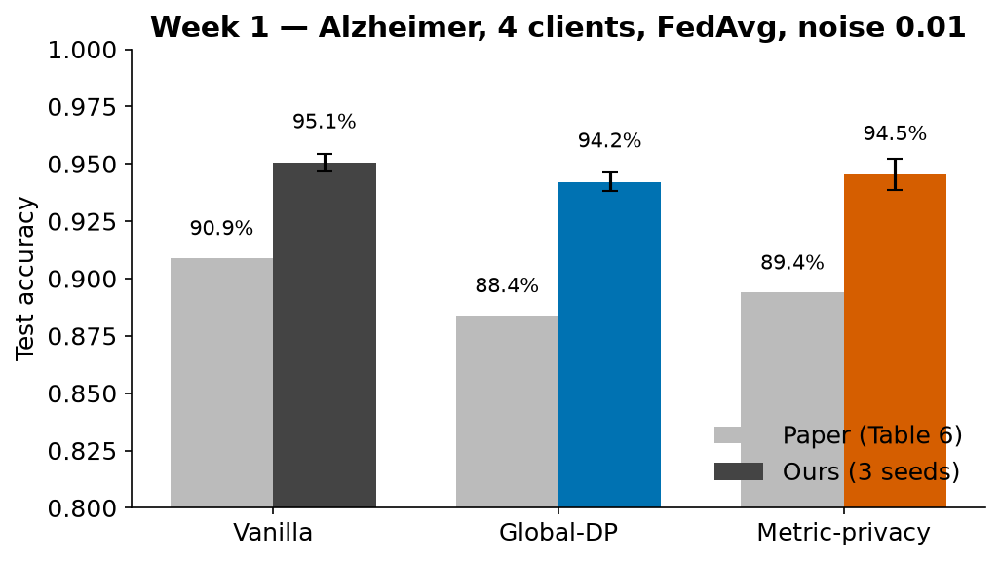

So next, we looked for settings where their behavior separates more clearly.

---

# Week 2 — Find a setting where the methods differ

**Why:** If metric-privacy helps, it should show when the noise is stronger or when there are more clients.

**What we ran**

- More noise at 4 clients.
- 8 clients, noise levels from 0.01 up to 1.0.
- Separately, the same comparison at 48 clients.
- A 48-client sweep where we matched the *actual* noise, not the setting.
- First attack scores at 48 clients.

---

# Week 2 — What we learned

- **4 clients:** no middle ground. Either the methods are tied, or training stops working.
- **8 clients:** a gap finally shows at noise 0.05 — metric-privacy is **8 points** more accurate than global-DP. One step more noise, and both stop learning.
- **48 clients:** the gap is gone.

- The same noise setting means *less* real noise when there are more clients. So 8-vs-48 was not a fair comparison.

**So next:** The interesting zone is a thin band just before training breaks, and that band moves with the number of clients. We need a noise setting that means the same thing at any client count.

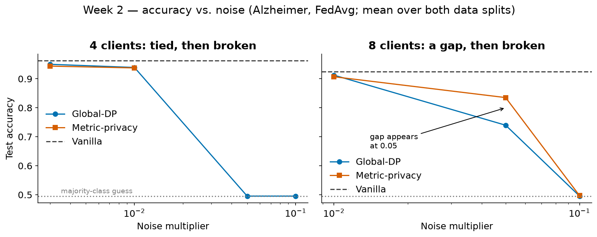

---

# Week 3 — Can we trust our own numbers?

**Why:** 
1. We realized our pipeline is not reproducible. Numbers differed between runs.
- Found and fixed two real bugs:
  - Flower added up client updates in whatever order they arrived. Tiny rounding differences grew over rounds.
  - A zero-size update crashed the run.
- Re-ran the client-scaling study on GPU with the fixes: 40 runs, 0 failures.
- Built a Google Colab pipeline. Ran the paper's attack on Alzheimer, plus Fashion-MNIST and a 4-class CIFAR-10, at three noise ratios.

2. Total noise decreases as clients grow due to the formula.
- Add the concept of noise ratio to counter it. (Show image of canceling client counts here)
- A grid of 4 client counts × 6 noise levels: 96 runs, 0 failures.

---

# Week 3 — What we learned

**1. Reproducibility**

- Identical runs now give identical results.
- With clean numbers, metric-privacy's advantage **shrinks** as clients grow: +14 points at 4 clients → 0 at 48. It shrinks; it doesn't flip.
- **Attack:** the paper says noise makes the attacker guess at random. On Alzheimer we could not reproduce that — the attacker still wins 83–93% of the time.

**2. Noise ratio**

- With the ratio, the client count cancels out of the noise formula. The same ratio now means the same real noise at 8 or 48 clients.
- The grid confirms the problem it fixes: the noise level where training breaks **rises with client count** (0.05–0.1 at 8 clients, 0.1–0.25 at 16 and above).
- Right at that edge, metric-privacy is up to **18 points worse** than global-DP.

**So next:** All later experiments use fixed noise ratios (0.0025, 0.004, 0.00625) on GPU. The "breaks at the edge" problem becomes the thing to fix in a redesign.

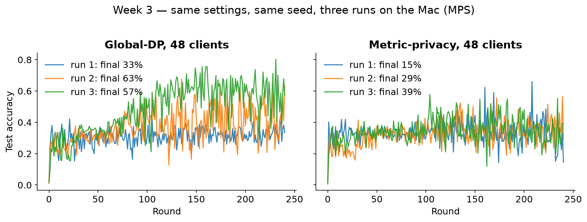

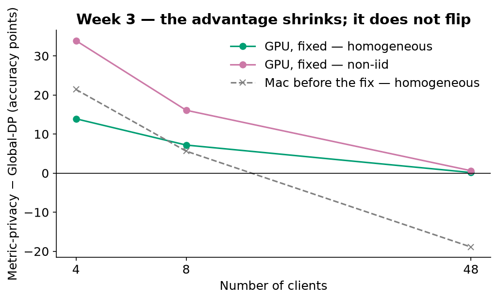

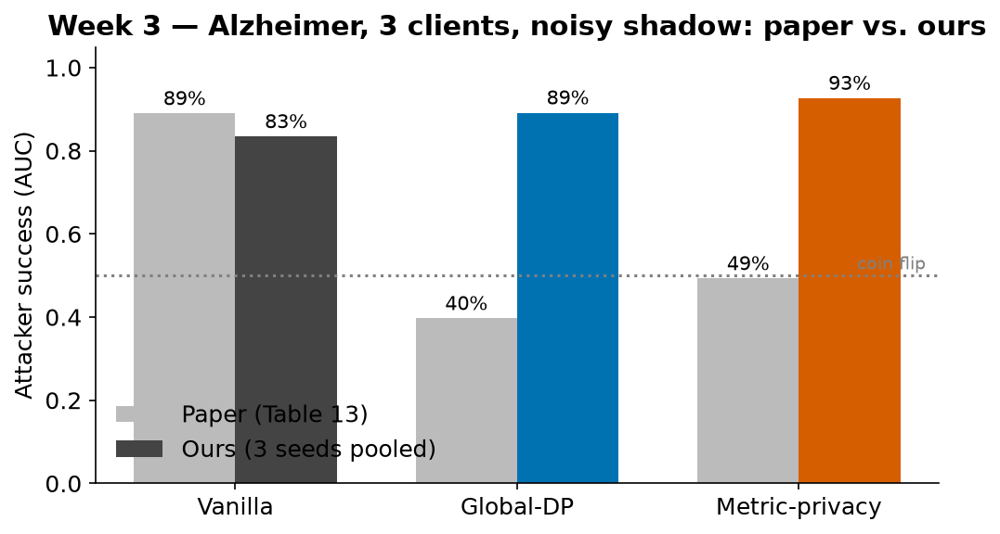

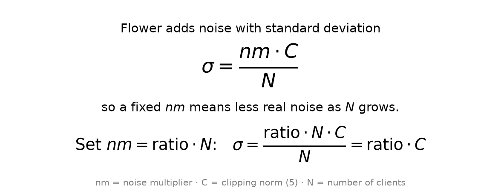

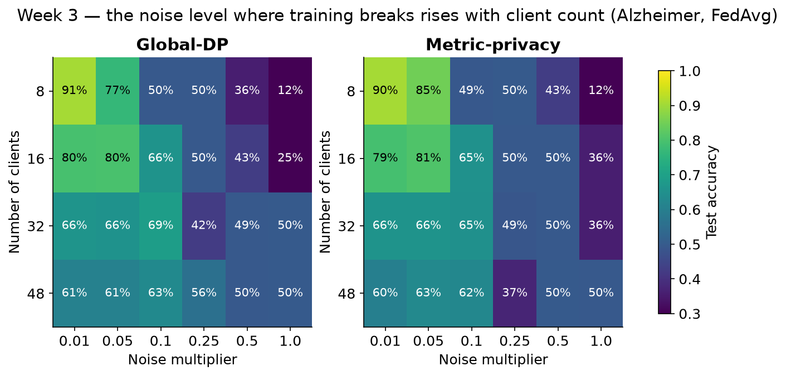

---

# Week 4 — Move to bigger datasets

- Try bigger datasets
- Try more clients
- Use the new noise ratio technique 

**What we ran**

- Full CIFAR-10 attack at 8, 16, 48 and 100 clients, then the three noise ratios at each count.
- CIFAR-100 with 100 clients, 250 rounds. Tried five model designs, kept the supervisor's.
- EuroSAT satellite images, 48 clients, 100 rounds, 3 seeds.

---

# Week 4 — What we learned

- **More clients → harder attack.** Even with Vanilla, attack accuracy drops from 93% to 56% as we scale clients from 8 to 100.
- Noise helps at small client counts (73% at 8 clients instead of 93%), but by 100 clients everyone is at 54–56% — the client count alone does the job.
- Metric-privacy gives no advantage over global-DP here. The two are within 2 points of each other at every client count (73 vs 71, 66 vs 67, 69 vs 70, 54 vs 56).
 
- **More noise → harder attack.** At 8 clients, the attacker drops from 93% with no noise to 65–71% at the highest ratio.

**The key result: metric-privacy keeps its accuracy and global-DP loses it.**

8 clients, CIFAR-10:

| Noise ratio | Metric-privacy: accuracy / attacker | Global-DP: accuracy / attacker |
|-------------|-------------------------------------|--------------------------------|
| 0.0025      | 71% / 73%                           | 69% / 72%                      |
| 0.004       | 71% / 73%                           | 62% / 69%                      |
| 0.00625     | **70%** / 71%                       | **47%** / 65%                  |

- Same pattern at 48 and 100 clients.

**So next:** 
1. Is metric privacy better than global-DP in the pareto frontier of accuracy vs CIA safeness?
2. Validate those two learnings

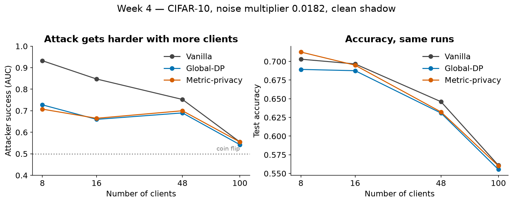

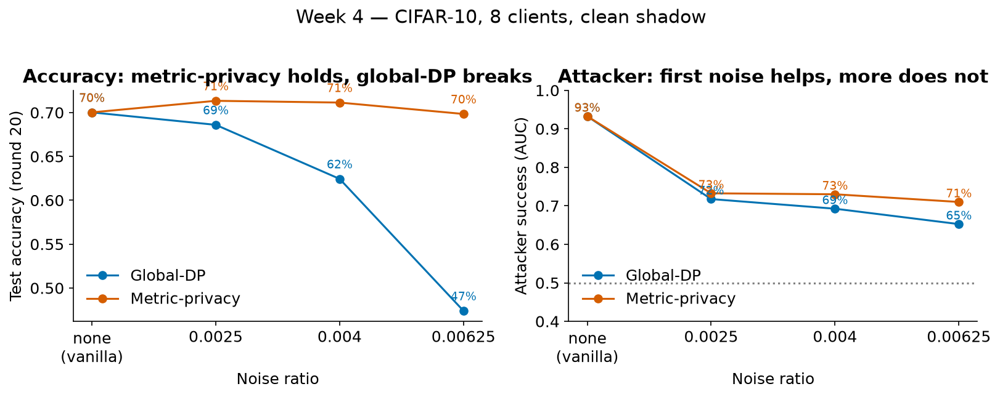

---

# Week 5 

Check if our naive data splitting is affecting our CIA results
Check if metric privacy has a better curve than global-DP in a accuracy vs CIA ROC_AUC plot. 

**What we ran**

- New Dirichlet splitter runs to compare with the previous splitter results.
- Some runs to show metric privacy is a better curve than global-DP.
 
---

# Week 5 — What we learned

1. Dirichlet splitter did not lead to better CIA results. Our old data is proven valid.
2. The runs were WIP, Ata couldn't join this week so we don't know the results yet.

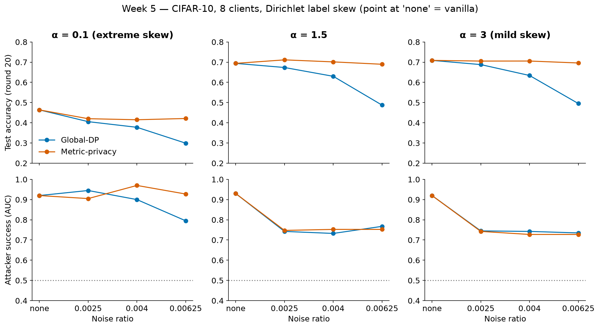

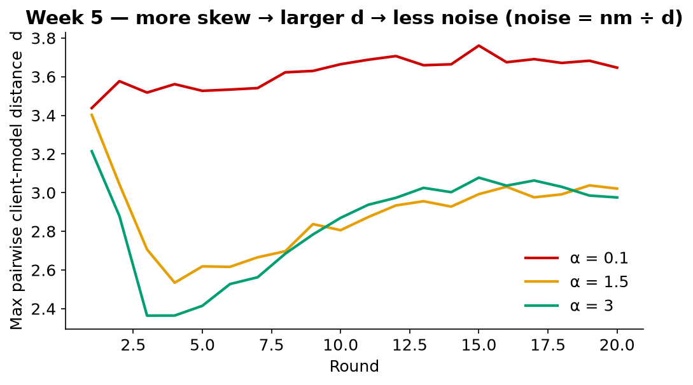
