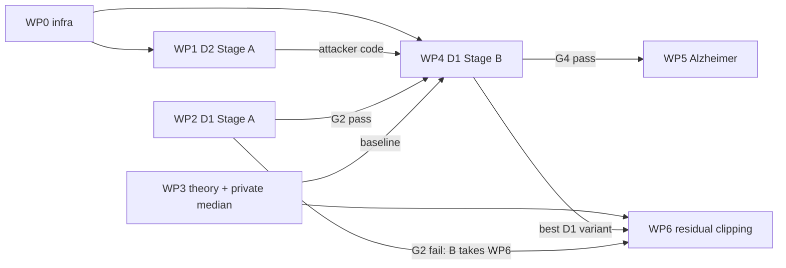

# Autonomous agent roadmap: CIA research programme

Version 1, 2026-10-10. Audience: Claude Code agents working without supervision on this repository. Owner decisions in
Section 1 are binding and supersede conflicting wording in `HANDOFF.md` and `research_directions.md` (for example, the
second dataset is Alzheimer MRI, not CIFAR-10). Background and rationale live in
[research_directions.md](research_directions.md); this file says **who does what, in which order, when to stop, and
what to hand back**.

## 0. How to use this file

Every agent, every session:

1. Follow `AGENTS.md` session start (read `STATUS.md`, `git log --oneline -10`).
2. Read Sections 1, 3 and 4 of this file, then your agent block in Section 5 and your work packages in Section 2.
3. Read `research_directions.md` for your direction (hypothesis, formal argument, kill criteria) and
   `project_state.md` Section 4 (failed ideas; do not repeat them).
4. Check the state of the work packages you depend on (Section 3.4), then continue your own from its `STATE.md`.

## 1. Owner decisions (binding)

| Topic | Decision |
|---|---|
| Programme | Execute D2 (defense-aware audit), D1 (signature-suppressing local training under a fixed client-level DP noise law), D3 (theory) and D4 (private dispersion, residual clipping) as work packages WP0-WP6 below. D5 and D6 are on hold (unlock rules in Section 2). |
| Threat model | The participant count is **secret**. Every mechanism (vanilla excepted) must keep the noise standard deviation independent of who participates: scale the noise multiplier by the active client count, as `results/cia_frontier/eurosat_frontier/runner.py` already does, or use a fixed public slot count. |
| Aggregation | **Equal public weights** (`--aggregation-weighting equal`) for all primary runs, so that DP sensitivity is `C/n`. Size-weighted aggregation appears only as a secondary reference condition where stated. |
| Worst-case targets | The top decile of clients by local dataset size (equal to aggregation weight under size weighting). Report them separately in every analysis. |
| Datasets | Primary: EuroSAT, Dirichlet alpha 0.3, 48 clients. Second: **Alzheimer MRI**, in two settings: the paper's 3-client federation and 48 clients (homogeneous partition; see WP5 for the collapse caveat). |
| Compute | **Owner PC** for small jobs: unit tests, log analyses, theory calculations, smoke runs (at most 5 rounds), federations of at most 8 clients. **Compute server** for everything else (any 48-client run beyond a smoke test). Use these two machine-role labels in all committed files; never hostnames, IPs or usernames. |
| Training authority | Agents may launch runs within the caps in Section 2 without asking. Exceeding a cap by more than 25% requires escalation (Section 4.4). |
| Merging | Agents **never merge into `master`** and never declare an experiment finished. They push their branches; the owner reviews, merges and decides when to write `reports/`. Merging another agent's pushed branch **into your own feature branch** is allowed where Section 2 says so. |
| Commits | Never add a `Co-Authored-By` trailer. |

## 2. Work packages

Trajectory-hour (t-h): the wall time of one 48-client, 100-round EuroSAT trajectory on the machine that produced the
committed frontier logs (median 0.68 h training + 0.06 h evaluation). A 50-round trajectory is about 0.37 t-h.
Removal adjacency needs one IN trajectory per seed and one OUT trajectory per target and seed. Measure your own first
trajectory, re-estimate the package cost, and record both numbers in `STATE.md`.

| WP | Agent | Branch | Machine | Depends on | Cap | Gate |
|---|---|---|---|---|---|---|
| WP0 Shared infrastructure | A | `feature/cia-infra` | PC | none | no training | G0 |
| WP1 D2 Stage A: side channel and increment attacker | A | `feature/cia-audit` | PC | WP0 | 15 t-h | G1 |
| WP2 D1 Stage A: screen | B | `feature/signature-suppression` | server | none (WP0 optional) | 30 t-h | G2 |
| WP3 D3 theory and D4 item 1 (private median distance) | C | `feature/private-dispersion` | PC | none | no training beyond smoke runs | G3 |
| WP4 D1 Stage B: EuroSAT frontier | B | `feature/signature-suppression` | server | G2 pass, WP0, WP1 attacker code; WP3 baseline if ready | 300 t-h | G4 |
| WP5 Alzheimer replication | A | `feature/cia-alzheimer` | PC (3 clients), server (48) | G4 pass | 120 t-h | G5 |
| WP6 D4 item 2: residual clipping | C (or B if G2 fails) | `feature/residual-clipping` | server | WP3; WP4 result if D1 is alive | 60 t-h | G6 |

Results directories (one per package; create them, keep code that is specific to the package beside them):
WP1 `results/cia_frontier/side_channel_audit/`, WP2 and WP4 `results/cia_frontier/signature_suppression/` (`stage_a/`,
`stage_b/`), WP3 `research/cia_review_2026-10/theory/` plus new code files listed below, WP5
`results/cia_frontier/alzheimer_replication/`, WP6 `results/cia_frontier/residual_clipping/`.

### WP0 Shared infrastructure (Agent A)

Deliver on `feature/cia-infra`, push, then tell others via `STATE.md` (Section 3.4):

1. Fixed noise standard deviation across removal for every runner the programme uses, including the small-federation
   plan suite (`results/contest_at_scale/plan_suite/planned_runs.py`), whose global-DP noise currently scales with the
   active client count (noise L2 norm 42.55 with 3 clients vs 63.82 with 2).
2. Server-side per-round, per-client diagnostic: norm of the client update minus the leave-one-out mean update, before
   clipping (`metricdp_pytorch/metricdp_strategy.py`, `globaldp_strategy.py`, `dp_diagnostics.py`).
3. Attack-side per-round scalars for the target shadow sample: loss before and after each round's update (the
   increment) and the shadow-gradient norm at the round's start model (`experiments/cia/`).
4. Default-off flags so every existing run is unchanged; synthetic unit tests for each item; `uv run pytest` green.

### WP1 D2 Stage A (Agent A)

Protocol, then runs: EuroSAT and Alzheimer, 3, 5 and 8 clients, fixed noise standard deviation, global DP and metric
privacy, 3 seeds, all clients as targets in turn, 50 rounds. Two attacks: (a) oracle-reference noise-level attack
(estimate sigma from the norm of each released update, compare with reference federations that exclude the target);
(b) per-round increment likelihood-ratio attack with the known noise law (`research_directions.md`, D2 item 2). Compare
both with the repository's current statistic on the same runs. Deliver the increment attacker as reusable code
(scorer function plus tests) because WP4 needs it.

### WP2 D1 Stage A screen (Agent B)

Exactly the design in `research_directions.md` D1 Stage A and `HANDOFF.md` Section 4, with the owner decisions applied:
EuroSAT alpha 0.3, 48 clients, seed 42, 50 rounds, no DP, equal weights. Five targets fixed before running: the two
largest by dataset size plus three spread over the size range (`research/cia_review_2026-10/data/target_idiosyncrasy_vs_cia_score.csv`).
Ten configurations: vanilla (equal weights); vanilla (size-weighted, reference); weight decay 5e-4; local epochs 1;
FedProx mu 0.01, 0.1, 1; fixed local step budget; consensus KL beta 0.3, 1. Code: expose FedProx mu (currently 0.5 in
`metricdp_pytorch/strategy_factory.py`), add the consensus-KL term next to `proximal_term` in
`experiments/reproduce/paper_training.py`, add a fixed-step option, plumb through `experiments/reproduce/client.py`;
defaults leave existing runs unchanged. If WP0 is pushed, merge `feature/cia-infra` into your branch to get the
diagnostics; otherwise run without them.

### WP3 D3 theory and D4 item 1 (Agent C)

1. Theory note `research/cia_review_2026-10/theory/f_cmip.md`: client-level hypothesis test for a partial-knowledge
   attacker (shadow sample of size `m`), the trade-off function for a `k`-dimensional attacked statistic, and the
   first-order participation-gap result (D1, P2) with its assumptions. Numerical checks in a script beside it.
2. Private median-distance metric privacy ("leak-free metric privacy"): replace the max pairwise distance by a
   privately released median (smooth sensitivity or propose-test-release; see `research_directions.md` D4 item 1).
   Write the privacy proof in `theory/private_dispersion.md`, implement it in a **new** file
   `metricdp_pytorch/private_metric_strategy.py` with unit tests in `tests/`, and account its privacy cost in the total
   budget. Do not edit `strategy_factory.py` (Agent B owns it); construct the strategy from your own runner or factory
   function. Smoke-run it on the PC only.

### WP4 D1 Stage B (Agent B)

Start only after G2 passes. Merge `feature/cia-infra` and `feature/cia-audit` (for the increment attacker) into your
branch. Design: the two best Stage A variants combined with global DP at three noise ratios, against global DP alone,
metric privacy alone, private-median metric privacy (from WP3 if pushed and G3 passed; otherwise add it later as a
supplement), and vanilla, all with equal weights and a fixed noise standard deviation; 3 seeds, 8 targets, 100 rounds,
EuroSAT. Reuse committed runs only where their configuration matches exactly (it will not for equal weights; do not mix).

### WP5 Alzheimer replication (Agent A)

Start only after G4 passes. Two settings with the WP4 protocol restricted to the best variant: (a) the paper's
3-client federation (PC); (b) 48 clients, homogeneous partition, built on
`results/contest_at_scale/auc_frontier/alzheimer_remove.py` (server). Caveat from the AUC-targeted sweep: at 48
clients metric privacy (homogeneous) and both mechanisms (non-IID) collapsed before reaching the target noise, and
global DP (homogeneous) landed at noise ratio 2.49e-03; choose the noise grid below collapse and record the accuracy at
each grid point before any attack.

### WP6 D4 item 2: residual clipping (Agent C, or Agent B if G2 fails)

Release `c_t + (1/n) sum_i clip(u_i - c_t, rho) + noise` with `c_t` the previous released update and `rho` from a
private quantile; proof that add/remove sensitivity is `rho` under a fixed slot count, unit tests, then a Stage A style
screen (EuroSAT, 48 clients, 50 rounds, 5 targets) against plain clipping at the same guarantee, composed with the
best D1 variant if D1 is alive.

### On hold

- D5 (temporal allocation): unlock when the WP1 attacker exists and WP4 has finished; owner assigns.
- D6 (low-dimensional sharing): unlock only if G3 reports a useful bound in the `d ~ n` regime; owner assigns.

## 3. Gates, dependencies and coordination

### 3.1 Dependency graph



### 3.2 Gates

Rules are copied from `research_directions.md`; thresholds are fixed and must not be tuned after seeing results.

| Gate | Pass | On pass | On fail |
|---|---|---|---|
| G0 | `uv run pytest` green; synthetic tests show the fixed-noise option gives identical noise IN/OUT and the logged scalars match hand computations | Push; set `STATE.md` to `ready` | Fix; do not start WP1 |
| G1 | (a) Noise-level attack AUC > 0.55 for top-decile targets in 3-8 client federations: keep the side-channel claim. (b) Increment attacker beats the current statistic at TPR at 5% FPR: it becomes the primary attacker for WP4 | Continue as stated | (a) drop the side-channel claim, record the negative result; (b) WP4 uses the current statistic as primary and the increment attacker as secondary |
| G2 | Some variant lowers the pooled clean-view score or AUC by at least 0.05 vs vanilla (equal weights) at no more than 1 pp accuracy loss, **and** beats weight decay and local-epochs-1 at matched accuracy | Agent B starts WP4 | D1 stops; findings written; Agent B takes WP6 |
| G3 | (D3) the partial-knowledge bound is at least 20% tighter than the GDP bound in some runnable regime; (D4.1) proof complete, tests green, release of the median costs at most 10% of the total privacy budget | D3 becomes a paper section; D4.1 becomes the leak-free baseline for WP4 | D3 stays a short note; WP4 runs without the D4.1 baseline |
| G4 | At matched defense-aware AUC and TPR at 1% FPR, at least 2 pp accuracy over the better of global DP and metric privacy on EuroSAT (3 seeds), **and** a reduction for top-decile targets | WP5 starts | D1 stops; findings written; WP6 continues without D1 |
| G5 | The G4 criterion holds in at least one of the two Alzheimer settings without contradicting it in the other | Programme ready for owner synthesis | Record as dataset-specific; escalate |
| G6 | Residual clipping costs at most 2 pp accuracy vs plain clipping at the same guarantee and reduces CIA for top-decile targets | Record; owner decides on composition with D1 | D4 item 2 stops |

**Inconclusive results.** If the 95% cluster-bootstrap interval of the gate statistic straddles the threshold, run the
extension declared in your protocol once (for Stage A: one more seed for the two best configurations). If it still
straddles, mark the gate `inconclusive`, stop the package and escalate. Never add further runs to push a result over a
threshold.

### 3.3 Standard measurement (all packages)

- Attack statistics: the repository's clean-view and noisy-view scores
  (`results/cia_frontier/eurosat_frontier/analyze.py`), AUC, TPR at 5% and 1% FPR pooled over rounds and targets, and
  the increment attacker once available. Intervals: 2,000-resample cluster bootstrap by target-seed.
- Utility: server test accuracy at the final round, plus per-client held-out accuracy (fairness check).
- Matched comparisons: accuracy at matched attack level by interpolating along each mechanism's noise grid, and attack
  level at matched accuracy; state which.
- Subgroups: top-decile targets reported separately in every table.
- Findings files open with at most two plain-language claims, each supported by one plot (the project supervisor's
  stated preference), then the full tables.

### 3.4 Coordination without shared state

Each package keeps a `STATE.md` in its results directory on its own branch, updated at every commit-worthy step:

```
package: WP2
status: planning | running | gate-pending | passed | failed | inconclusive | blocked | done
gate: G2 = <value with interval> (<pass|fail|inconclusive>)
protocol: <path> @ <commit hash>
machine: owner PC | compute server
cost so far: <t-h measured> of <cap>
next: <one line>
needs from others: <package and item, or none>
```

To read another package: `git fetch origin && git show origin/<branch>:<results-dir>/STATE.md`. Do not edit files on
another agent's branch. Merge another agent's branch into yours only when Section 2 says so and its `STATE.md` says
`ready`, `passed` or `done`.

File ownership (edit only your own; ask through `STATE.md` "needs from others" otherwise):

| Agent | Owns |
|---|---|
| A | `metricdp_pytorch/metricdp_strategy.py`, `globaldp_strategy.py`, `dp_diagnostics.py`, `experiments/cia/`, `results/cia_frontier/eurosat_frontier/runner.py`, `results/contest_at_scale/plan_suite/planned_runs.py`, WP1 and WP5 directories |
| B | `experiments/reproduce/paper_training.py`, `experiments/reproduce/client.py`, `metricdp_pytorch/strategy_factory.py`, WP2/WP4 directory |
| C | `metricdp_pytorch/private_metric_strategy.py` (new), its tests, `research/cia_review_2026-10/theory/`, WP6 directory |

`STATUS.md`: each agent maintains only its own bullet under Active work and its own rows of the Currently running
table, on its own branch.

## 4. Operating rules for autonomous work

### 4.1 Before any run

- Write `PROTOCOL.md` in the package directory and commit it **before** the first run: design, targets, seeds,
  configurations, metrics, gate rule copied verbatim, extension rule, compute estimate. Record the commit hash in
  `STATE.md`.
- Runners plan by default and execute only with `--execute` (pattern of
  `results/cia_frontier/influence_noise/runner.py`).
- Smoke-test every configuration for at most 5 rounds on the PC before the server run.
- Changing a protocol after runs started requires a dated amendment section stating the reason, committed before the
  affected runs. Amendments may not change a gate threshold.

### 4.2 On the compute server

- Record each launch in your `STATUS.md` Currently running rows (machine-role label only) and in `STATE.md`.
- Check GPU memory before launching (earlier sessions lost runs to contention on a shared machine); pin GPUs with
  `CUDA_VISIBLE_DEVICES`. If several agents need the server at once and the owner has not assigned GPUs, queue in this
  order: WP2, WP4, WP5, WP6.
- Long runs must be resumable at the combination level (completed result files are skipped on restart); write result
  files atomically.

### 4.3 Integrity

- Every number in a findings file comes from a committed result file or a script that reads one. No estimates
  presented as results.
- Negative and inconclusive outcomes get the same write-up as positive ones.
- Do not re-tune a mechanism's hyperparameters on the evaluation targets; tuning uses separate seeds or targets declared
  in the protocol.
- Large artifacts follow `.gitignore` (`*.npz`, `*.pt` under `results/` are not committed).

### 4.4 Escalate to the owner and stop when

1. A gate is inconclusive after its single extension.
2. The projected cost exceeds the package cap by more than 25%.
3. You need to edit a file another agent owns, or change the threat model, adjacency or a gate.
4. A result contradicts an established project finding (for example, metric privacy beating global DP at matched
   leakage) after you have re-checked the code path.
5. Tests on `master` fail before your changes, or a dependency branch is broken.

To escalate: write `ESCALATION.md` in your package directory (what happened, evidence, options with a recommendation),
set `STATE.md` to `blocked`, commit, push, and stop working on that package. You may continue another package that
does not depend on it.

### 4.5 Session end

Commit and push your branch, update `STATE.md` and your `STATUS.md` bullet. When a package reaches `passed`, `failed`
or `done`, write `FINDINGS.md` beside its protocol (Section 3.3 format). Do not write files under `reports/`.

## 5. Agent prompts

Paste the common preamble, then one agent block. Each agent runs in its own sparse worktree
(`.agents/skills/worktrees/SKILL.md`); add the data paths it needs with `git sparse-checkout add` (for re-running the
review scripts: `/results/cia_frontier/eurosat_frontier/results/` and `/results/contest_at_scale/plan_suite/results/`).

**Common preamble**

```
You are an autonomous research agent on this repository. Follow AGENTS.md. Then read, in order:
HANDOFF.md; research/cia_review_2026-10/agent_roadmap.md (Sections 0-4 and your agent block);
research/cia_review_2026-10/research_directions.md (your directions); research/cia_review_2026-10/project_state.md Section 4.
The owner decisions in agent_roadmap.md Section 1 are binding. Work through your work packages in order,
obey the gates, file ownership, caps and escalation rules, and never merge into master.
Before your first code change, write your package's STATE.md and reply in the session with five bullets:
hypothesis, mechanism, baselines, the gate rule copied verbatim, files you will touch.
```

**Agent A (audit and infrastructure)**

```
You are Agent A. Your packages: WP0 (feature/cia-infra), then WP1 (feature/cia-audit, branched from master
with feature/cia-infra merged in), then WP5 (feature/cia-alzheimer) only after WP4's STATE.md shows G4 passed.
Machine: owner PC for WP0, WP1 and the 3-client part of WP5; compute server for the 48-client part of WP5.
Priority: push WP0 early; Agents B and C depend on it.
```

**Agent B (signature suppression)**

```
You are Agent B. Your packages: WP2 then WP4, both on feature/signature-suppression (branch from master).
Machine: compute server (smoke tests on the owner PC). Merge feature/cia-infra when its STATE.md says ready,
and feature/cia-audit before WP4. If G2 fails, write FINDINGS.md for WP2 and take over WP6 on
feature/residual-clipping (coordinate through STATE.md with Agent C).
```

**Agent C (theory and private dispersion)**

```
You are Agent C. Your packages: WP3 on feature/private-dispersion (branch from master), then WP6 on
feature/residual-clipping once WP3 is done (and, if D1 is alive, after WP4's STATE.md reports its best variant).
Machine: owner PC for WP3; compute server for the WP6 screen. Do not edit strategy_factory.py.
If WP2's STATE.md shows G2 failed, WP6 belongs to Agent B: finish WP3, then review B's WP6 proof and
record your review in your own STATE.md.
```

## 6. Indicative timeline

| Week | Agent A | Agent B | Agent C |
|---|---|---|---|
| 1 | WP0 (push by mid-week), start WP1 protocol | WP2 code, smoke tests, protocol, launch screen | WP3 theory note, private median design |
| 2 | WP1 runs and G1 | WP2 analysis, G2 | WP3 implementation, proof, G3 |
| 3-4 | WP1 findings; idle or support | WP4 runs (server) | WP6 proof and code |
| 5 | WP5 (if G4 passed) | WP4 analysis, G4 | WP6 screen, G6 |
| 6 | WP5 analysis, G5 | findings | findings |

At the end the owner (or an agent the owner assigns) reads every branch's `FINDINGS.md` and decides on merges, a
synthesis document and any `reports/` write-up.
