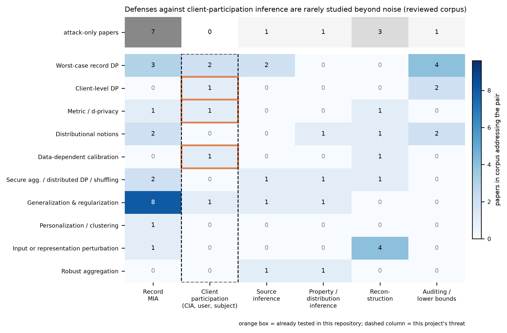

# Broad survey sweep: FL privacy defenses and inference attacks

Date: 2026-10-10. Lighter-depth sweep (abstract or metadata level unless stated) that places the project's question inside the wider field. Every entry is in [`../paper_table.csv`](../paper_table.csv) with its verified DOI and read scope; tags are in [`../data/taxonomy_tags.json`](../data/taxonomy_tags.json) and the coverage matrix in [`../data/defense_attack_matrix.csv`](../data/defense_attack_matrix.csv). Search queries and raw hits are in [`search_logs/`](search_logs/). The earlier version-1 review in `research/literature_review/` remains the deeper source for distributed DP, covariance/learned noise, temporal noise and non-Gaussian mechanisms; it is not repeated here.

**Figure.** Number of corpus papers that propose or evaluate each defense family (rows) against each attack family (columns); the top strip counts attack papers that evaluate no defense. Orange boxes mark the cells this repository has already tested; the dashed column is the project's threat. Counts describe this corpus (95 papers), not the whole literature.

## How the field is organized

**Attack families.** Record-level membership inference dominates (Shokri-style shadow models, LiRA, enhanced reference attacks; in FL, white-box passive/active attacks and FedMIA's use of non-target clients' updates). Above the record level sit three distinct client-granularity questions that are easy to conflate: *participation* (was this client's dataset used? the project's CIA, Kandpal's user inference, Suri's subject inference), *source attribution* (which client holds this record? Hu et al.'s SIA), and *property/distribution inference* (what does a client's data look like? Melis et al., distribution inference, quality inference). Reconstruction (DLG, gradient inversion) and auditing (canaries, one-run audits, adversary instantiation) complete the picture.

**Defense families.** Worst-case DP at record or client level remains the reference, with accounting refinements (GDP, RDP, subsampling, DP-FTRL, time-adaptive spending, individual filters). Distributional notions relax the adversary or the data-generating assumptions (Pufferfish, Bayesian DP, membership-inference privacy, GMIP, PAC privacy, noiseless privacy, relaxed-threat DP). Data-dependent calibration covers smooth sensitivity, propose-test-release, adaptive clipping, hyperparameter tuning and the paper's metric calibration. Cryptographic and architectural defenses (secure aggregation, distributed DP, shuffling, virtual nodes) hide individual updates but not the aggregate. Generalization-based defenses (adversarial regularization, RelaxLoss, HAMP, self-distillation, SAM) target the overfitting that powers membership inference. Personalization, input/representation perturbation and robust aggregation form smaller families.

## What the sweep says about the project's threat

1. **Client-participation inference has attacks but almost no dedicated defenses.** In this corpus only the baseline paper, Kandpal et al.'s mitigation study and Suri et al.'s DP evaluation address the participation question with a defense. The heavily populated "generalization and regularization" row is almost entirely record-level.
2. **Outlier clients carry the risk.** Kandpal et al. (outliers, correlated examples and larger contributions leak more), FinP (privacy risk concentrated in outlier clients under SIA), Jung et al. (small clusters raise MIA risk) and the project's per-target spread (scores 0.20-0.99) agree that leakage is heterogeneous. Uniform noise spends protection on clients that the crowd already hides.
3. **Distributional notions exist at client level only as accounting relaxations.** Triastcyn and Faltings' Bayesian DP for FL reports client-level epsilon below 1 for similarly distributed clients, but it is an accountant, not a CIA-specific hypothesis test, and its guarantee depends on the assumed client distribution. GMIP gives the hypothesis-testing form at record level. No corpus paper defines a membership-inference-style guarantee for whole-client participation.
4. **Data-dependent calibration has a mature formal toolbox** (smooth sensitivity, PTR with RDP accounting, privately estimated clipping quantiles) and a known failure mode (tuning on private data leaks). The baseline's metric calibration uses none of these tools.
5. **Generalization can rival DP against MI, but not uniformly.** Liu et al. report generalization techniques empirically outperforming DP against MIA; Kim et al. report that SAM can increase membership risk. Any regularization-based CIA defense must be tested against an adaptive attacker.
6. **Auditing at client level is available.** CANIFE (crafted canary clients) and one-shot estimation (random canary clients) measure per-round or whole-run empirical epsilon in FL; neither has been applied to metric-calibrated noise.

## Gaps that the directions document builds on

| Gap | Evidence it is a gap (this corpus) | Direction |
|---|---|---|
| No defense designed for CIA that reduces the client's *distributional signature* instead of adding noise | CIA column has no regularization/robust-aggregation defense; FinP does this for SIA only | D1 |
| No adaptive audit of metric-calibrated noise; noise level is a participation signal | Baseline gives no accounting; our log analysis (`project_state.md` Figure 3) | D2 |
| No hypothesis-testing guarantee for whole-client participation | GMIP is record-level; Bayesian DP is an accountant | D3 |
| No outlier-aware bounding of client influence relative to the crowd under a formal guarantee | Robust aggregation row has no CIA entry; robust-to-private reductions are generic | D4 |
| Temporal allocation of protection never tied to the participation-leakage profile | Time-adaptive spending targets utility; CIA gap profile measured here | D5 |
| Low-dimensional sharing (heads/adapters) as a route to crowd privacy | GMIP needs n >= d; PEFT-FL DP papers target utility | D6 |
