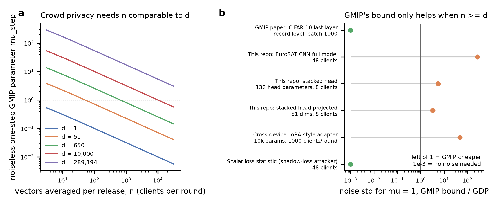

# Deep read of the two papers in `papers/`

Date: 2026-10-10. Both PDFs were parsed to text and read in full (GMIP: 13 pages, main text and references only, no appendix; Initial paper: 16 pages including appendices A-H). The earlier close reading of GMIP in `research/literature_review/local_gaussian_analysis.md` remains valid and should be read alongside this note; this note adds what matters for *beating metric privacy at client level*, which that analysis did not address.

## 1. Sáinz-Pardo Díaz, Athanasiou, Jung, Palamidessi, López García (2026)

*Metric-privacy-inspired noise calibration in federated learning: Improving convergence and preventing client inference attacks.* Knowledge-Based Systems 343:115993. [doi:10.1016/j.knosys.2026.115993](https://doi.org/10.1016/j.knosys.2026.115993). Preprint: arXiv:2502.01352.

| Field | Content |
|---|---|
| Threat model | Trusted server, fixed cross-silo roster, semi-honest clients; one client attacks another. Passive attacker sees the global model and aggregated round metrics; holds a shadow dataset of the target (10% of the target's training data; noisy copy in the multi-round test). Active and adaptive CIA are named as future work (§5.2). |
| Privacy notion | Metric privacy (d-privacy, Definition 7) used only as a *design principle*; no formal guarantee is claimed (§1, §6). |
| Mechanism | Server clips updates at C = 5, aggregates, adds N(0, sigma^2) with sigma = z C / (n_c d^(r)), d^(r) = max pairwise mean-layer Frobenius distance between client models (Algorithm 1). |
| Evaluation | Alzheimer MRI, 4 clients for utility (homogeneous and non-IID, 6 aggregators), 3 clients for CIA (Table 9; anomalous target). First-round relative loss gap (Tables 10-12) and 20-round AUC over per-round scores (Table 13). |
| Key results | Metric privacy more accurate than global DP in every reported aggregator/setting at z = 0.01 (Tables 7-8, A.14). CIA: AUC vanilla 0.890, global DP 0.397, metric privacy 0.493; IN accuracy 0.948 / 0.637 / 0.794. |
| Stated limitations | Single dataset and architecture, metric chosen on a validation set, one adversarial model; future work: larger federations, cross-device, adaptive/colluding attackers, Pareto frontier. |

### Assessment relevant to this project

1. **The comparison is not at matched protection.** The paper itself says it "does not aim to perform a fair comparison" (§4) because the two mechanisms add different noise. The project's matched-risk study found the advantage disappears once leakage is matched (`experiments/stacked_head/protocols/2026-10-09_baseline_comparison_findings.md`).
2. **The direction of the calibration is anti-aligned with the clients CIA hurts most (our deduction).** `d^(r)` is a maximum, so it is set by the most atypical client. Including an outlier raises `d^(r)` and *lowers* the noise, exactly when the client most identifiable by its participation is present. In the paper's own CIA design the anomalous target is in the maximum-distance pair in 97-98% of rounds of the repository's 3-client runs (`project_state.md` Figure 3). A hypothesis-testing view (Section 2 below) says the opposite should happen: noise should grow with the target's atypicality relative to the crowd, and shrink only with the crowd's own spread.
3. **The noise level is a release.** Because sigma is a deterministic function of the participants' models, its value carries participation information; nothing in §6.1 accounts for it.
4. **CIA estimand.** Table 13 is a pooled AUC over 20 dependent rounds of a single IN and a single OUT trajectory; intervals overlapping 0.5 do not establish chance-level protection (`research/project_evidence_audit.md` §2).
5. **Textual inconsistency** on page 6 about whether d > 1 adds more or less noise (already recorded by the evidence audit).

## 2. Leemann, Pawelczyk, Kasneci (2023)

*Gaussian Membership Inference Privacy.* NeurIPS 2023. [arXiv:2306.07273](https://arxiv.org/abs/2306.07273); code `github.com/tleemann/gaussian_mip`.

| Field | Content |
|---|---|
| Threat model | Membership-inference (MI) game of Yeom et al.: training set drawn i.i.d. from a distribution D; the attacker decides whether a query point drawn from D was in it; full white-box model access; **no control over the training data** (no canaries), protected points are typical points from D (Table 1). |
| Privacy notion | f-MIP: the stochastic composition over query points of the trade-off functions T(A0; A1(x')) is at least f (Definition 4.2); mu-GMIP when f is the Gaussian trade-off g_mu (Definition 4.3). f-DP implies f-MIP (Theorem 4.2). |
| Mechanism | Noisy SGD: clip, average n gradients, add N(0, tau^2 I) to the mean. |
| Theory | One noisy SGD step is approximately mu_step-GMIP with mu_step = (d + (2 n_eff - 1) K) / (n_eff sqrt(2d + 4 n_eff K)), n_eff = n + tau^2 n^2 / C^2, K >= Mahalanobis susceptibility of the query gradient (Theorem 5.1, Corollary 5.1). Without noise, mu = O(sqrt(d/n)) (Remark 5.1). Asymptotic composition with subsampling (Lemma 5.1). |
| Attack | GLiR: an analytic likelihood-ratio test on observed mean gradients using a background estimate of the gradient mean and covariance; no shadow models (Algorithm 1). |
| Evaluation | CIFAR-10 (last layer, d = 650), Purchase (d = 2580), Adult (d = 1026); GMIP calibration gives markedly higher accuracy than GDP at equal mu; CIFAR-10 needs no noise for mu >= 0.86 (Figure 3). |
| Stated limitations | Composition across dependent SGD steps is loose; gap between bounds and practical loss-based attackers; bounds for weaker (API) attackers left to future work (§7). |

### What transfers to client inference, and what does not

The CIA game is the MI game lifted from records to clients: the target is a client, the "gradient" is the client's clipped update, `n` is the number of clients aggregated, and the background randomness is the **between-client variability of updates**. This lift is our proposal; the paper proves nothing at client level.

**Quantitative consequence (our arithmetic on Corollary 5.1; [`scripts/gmip_regime_calculator.py`](../scripts/gmip_regime_calculator.py), [`data/gmip_regimes.csv`](../data/gmip_regimes.csv)).** With a typical client (K = d), mu_step is approximately sqrt(2d/(1 + 2 n_eff)). Crowd randomness alone gives meaningful protection only when the number of aggregated clients is comparable to the attacker-relevant dimension:

| Regime | d | n | noiseless mu_step | noise for mu = 1, GMIP bound / GDP |
|---|---:|---:|---:|---:|
| GMIP paper, CIFAR-10 last layer (record level, batch 1000) | 650 | 1000 | 0.81 | 0 (no noise needed) |
| EuroSAT CNN full model, 48 clients (this repo) | 289,194 | 48 | 77.2 | 269 |
| Stacked head, 132 parameters, 8 clients (this repo) | 132 | 8 | 3.94 | 5.6 |
| Cross-device adapter, 10k parameters, 1000 clients | 10,000 | 1000 | 3.16 | 47 |
| Scalar shadow-loss statistic, 48 clients | 1 | 48 | 0.14 | 0 (no noise needed) |

When noise must be added, the theorem's bound scales roughly like sqrt(d) times the GDP parameter, so for d >> n it is far looser than GDP and Theorem 4.2 makes GDP the operative guarantee. Two implications follow. First, a client-level GMIP calibration of the *full model* cannot by itself beat global DP (and hence metric privacy) in the project's 48-client experiments. Second, the large gap between the full-gradient bound (mu ~ 77) and the scalar-statistic bound (mu ~ 0.14) is the formal version of the paper's own open problem: guarantees for **capability-restricted attackers** or **low-dimensional shared objects** are where distributional privacy can pay. Both are taken up by directions D3 and D6 in `research_directions.md`.

**Figure.** (a) Noiseless one-step GMIP parameter from Corollary 5.1 with K = d, as a function of the number of averaged vectors, for several dimensions. (b) Ratio of the noise standard deviation needed to reach mu = 1 under the GMIP bound versus under GDP (replacement adjacency, sensitivity 2C/n) for the regimes in the table; 1e-3 marks "no noise needed".

**Further cautions carried over from the earlier analysis.** The page-5 clipping formula is misprinted (`max` for `min`); the theorem's K is uncentered while Algorithm 1 centers it; the CLT and large-d approximations carry no finite-sample certificate; the protection is averaged over the population, so atypical points (and atypical clients) can be much less protected. For client-level use, the client population is non-IID by design, so "typical client" must be defined relative to a client-distribution model (for example, a Dirichlet label-skew prior), and K for outlier clients can exceed d by a large factor (the table's K = 10d column in `data/gmip_regimes.csv`).

## 3. Citation seeds harvested

From GMIP: Dong-Roth-Su GDP; Carlini et al. LiRA; Nasr et al. adversary instantiation and tight auditing; Steinke-Nasr-Jagielski one-run auditing; Andrew et al. one-shot empirical privacy estimation for FL; Maddock et al. CANIFE; Triastcyn-Faltings Bayesian DP; Izzo et al. provable membership inference privacy; Thudi et al. bounding membership inference; Tan et al. parameters-or-privacy; Yeom et al.; Ye et al. enhanced MIA.

From the Initial paper: Hu et al. source inference attacks (ICDM 2021); Zhu et al. deep leakage from gradients; Chatzikokolakis, Andrés, Bordenabe, Palamidessi "Broadening the scope of differential privacy using metrics" and Chatzikokolakis, Palamidessi, Pazii metric-based local DP; Galli, Biswas, Jung, Cucinotta, Palamidessi "Group privacy for personalized federated learning"; Shokri et al. and Nasr-Shokri-Houmansadr membership inference; Abadi et al. DP-SGD; McMahan et al. FedAvg.

These seeded the targeted search recorded in `notes/targeted_corpus.csv`.
