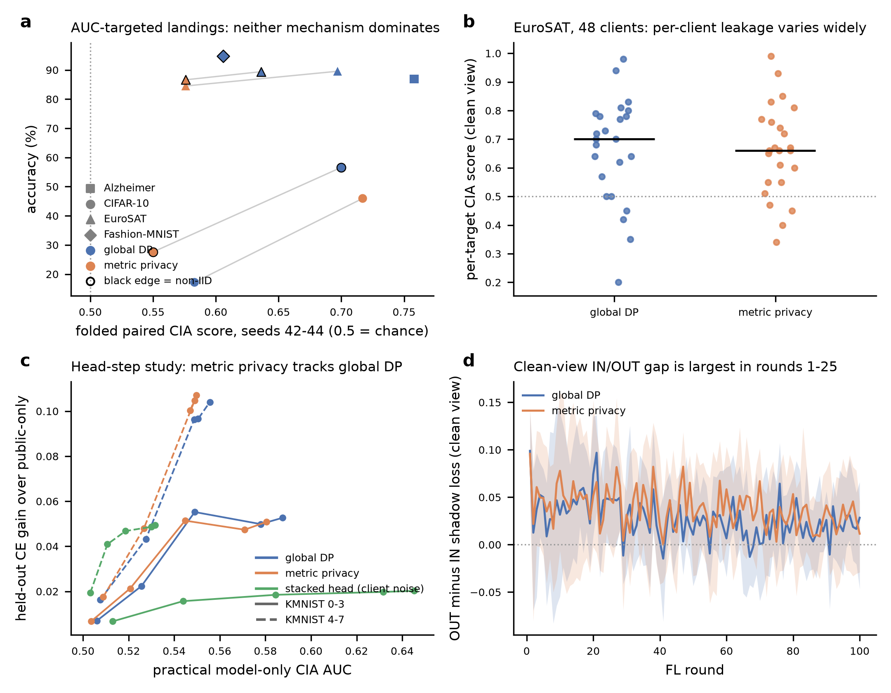
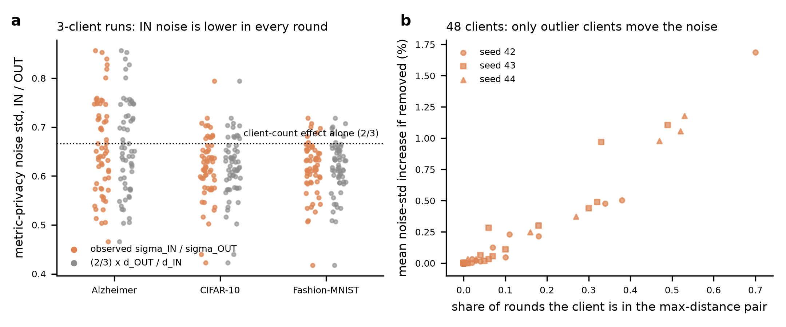
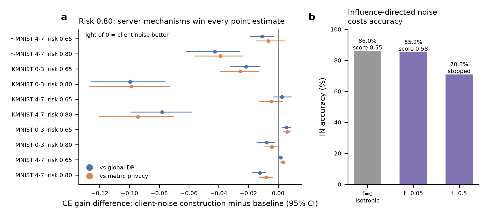

# Project state and lessons from the client-specific-noise direction

Date: 2026-10-10. Repository state inspected at `48efa26f` (`master`, "papers: add Gaussian Membership Inference Privacy"). This document is an evidence summary written for the next research phase; it does not declare any experiment finished and launches nothing. Every number below is either copied from a committed report (path given) or recomputed from committed result files by [`scripts/analyze_project_history.py`](scripts/analyze_project_history.py) (tables in [`data/`](data/)).

## 1. Goal and the baseline being challenged

The project's objective is a privacy technique for federated learning (FL) that protects better than the *metric-privacy-inspired noise calibration* of Sáinz-Pardo Díaz et al. (Knowledge-Based Systems 343:115993, 2026; `papers/Initial-Paper.pdf`) against **client inference attacks (CIA)**: a semi-honest participant, holding a shadow sample of a target client's data, decides whether that target's whole dataset took part in training.

The baseline mechanism (paper Section 6, Algorithm 1; `metricdp_pytorch/metricdp_strategy.py`) clips each client update to norm `C`, aggregates, and adds Gaussian noise with standard deviation

```
sigma_t = z * C / (n_t * d_t),   d_t = max_{i != j} (1/L) * sum_l || w_i^(l) - w_j^(l) ||_F
```

so the noise *falls* when the most distant pair of client models is far apart. The paper states explicitly that this is a heuristic and not a formal metric-privacy guarantee, and its prose on page 6 contradicts the equation about the direction of the effect (see `research/project_evidence_audit.md` §2). The paper's CIA evidence is one 3-client Alzheimer MRI federation with an anomalous target (Table 9), a first-round loss gap (Tables 10-12), and a 20-round AUC (Table 13: vanilla 0.890, global DP 0.397, metric privacy 0.493, all DP intervals overlapping 0.5) where metric privacy keeps 0.794 IN accuracy against 0.637 for global DP.

## 2. Codebase map (what a new agent needs)

| Path | Role |
|---|---|
| `metricdp_pytorch/metricdp_strategy.py`, `globaldp_strategy.py`, `strategy_factory.py` | Metric-privacy and global-DP server wrappers (Flower 1.32), deterministic reply ordering, per-round diagnostics (pairwise distances with client IDs, noise std, clip fractions) |
| `metricdp_pytorch/influence_noise.py` | Influence-directed matched-energy noise (pilot, no DP claim) |
| `experiments/reproduce/` | Paper reproduction runner, data/model plugins (Alzheimer, Fashion-MNIST, CIFAR-10/100, EuroSAT), FedAvg/FedAvgM/FedMedian/FedProx/FedOpt/FedYogi |
| `experiments/cia/` | CIA data modules (shadow split, partition views), attack runner, scorers |
| `results/cia_frontier/eurosat_frontier/` | Best current CIA protocol: EuroSAT, 48 clients, Dirichlet alpha 0.3, 10 targets, IN + OUT-t trajectories, 100 rounds |
| `experiments/stacked_head/` | Flower implementation of the closed direction's surviving construction; matched-risk comparison with the paper's mechanisms |
| `research/` (pre-existing) | Closed client-specific-noise record: literature review v1, proposals, calculations |
| `research/cia_review_2026-10/` | This review: state, literature review, directions, data, figures |

Run conventions are in `AGENTS.md` (uv, branch per experiment, never add `Co-Authored-By`, update `STATUS.md` at session end). Remote GPU workflows: `.agents/skills/running-experiments-colab/`, `running-experiments-lightningai/`.

## 3. Chronology of findings

1. **Reproduction (Jul-Aug 2026).** The mechanism reproduces at 4 clients; the effect is barely visible at the paper's `z = 0.01`. At 8 clients metric privacy beat global DP by +6.9 pp (homogeneous) and +12.2 pp (non-IID) at `z = 0.05`; at 48 clients with constant compute the advantage converges to parity (-2.5 to +0.6 pp). Metric calibration becomes unstable at each client count's collapse boundary (up to -18 pp vs global DP). Source: `STATUS.md` "What's established" (reports frozen at tag `freeze/2026-10-02`).
2. **CIA at scale (Aug 2026).** On five datasets DP lowers CIA scores directionally, but intervals are wide; "more clients lower the attack" held only partially, and only on CIFAR-10.
3. **AUC-targeted noise sweep (Sep 2026).** Searching the noise that drives the folded paired score to about 0.5 landed 10 of 16 curves; nine of ten landed means remained above 0.55 and no mechanism dominated (Figure 1a).
4. **EuroSAT per-client frontier (Sep 22-24).** At the landed noise, neither defense leaked less than vanilla (README: vanilla 0.69, global DP 0.61-0.72, metric privacy 0.60-0.71), and single-target scores ranged from about 0.2 to 0.99 (Figure 1b).
5. **Influence-directed noise (Sep 24).** Redistributing a fraction `f` of the same noise energy onto client-influence directions cost accuracy without lowering the attack (Figure 2b).
6. **Client-specific noise direction (Oct 1-9, closed by the owner).** About 40 protocol/finding documents and 38 calculation scripts. Outcome summarized in §4.

## 4. Why the client-specific-noise direction did not beat metric privacy

The table separates causes that are established by the record from explanations that remain hypotheses.

| Cause | Evidence status | Where |
|---|---|---|
| **Placement alone changes nothing for a model observer.** Local noise `N(0, Sigma_i)` aggregated with weights `a_i` produces the same released law as central noise with `V = sum a_i^2 Sigma_i`; a curious peer knows its own noise, so local placement is weakly worse against peers. | Mathematical deduction, independently reviewed | `research/threat_specification_review.md` §3, §7; `research/proposals/2026-10-06_observer_contract_review.md` |
| **Under worst-case whole-client DP, isotropic Gaussian is already optimal** for the tested envelope and public linear-workload utility; temporal correlation cannot improve it. Shape optimization therefore had little headroom. | Reviewed derivation, stated assumptions (dimension >= rounds, unrestricted per-round difference set) | `research/literature_review/temporal_noise_followup.md`; `research/proposals/2026-10-06_temporal_geometry_math_review.md` |
| **Non-Gaussian densities did not help** at matched attack strength (radial Laplace vs Gaussian); scalar multi-scale Laplace advantages do not survive many coordinates and rounds. | Empirical (fresh reserves) plus exact scalar arithmetic | `research/proposals/2026-10-07_matched_cia_findings.md`; `2026-10-08_noise_law_findings.md`; `literature_review/divisible_noise_methods.md` |
| **Private construction of the distribution must be paid for and can leak.** Data-dependent noise parameters expose an IN/OUT variance side channel. | Observed in a reduced metric adaptation (descriptor CIA) | `research/proposals/2026-10-07_descriptor_cia_findings.md` |
| **Noise on learning directions destroys utility.** Influence directions are where the model learns; `f = 0.5` lost 15.2 pp accuracy (70.81% vs 86.00%), `f = 0.05` cost 0.8 pp and raised the score 0.55 -> 0.58. | Single seed, equal-energy (not equal-accuracy) comparison, noise level too low to reduce attack | `results/cia_frontier/influence_noise/` |
| **Little private-signal headroom over public anchors.** The surviving stacked-head construction beats public-only models only at 32 public images, small at 128, gone at 512. | Pre-registered, fresh data | `experiments/stacked_head/protocols/2026-10-09_next_steps_findings.md` |
| **At matched calibrated risk the server mechanisms win** (Figure 2a): global DP better in 7 of 10 groups, metric privacy in 5 of 10; at risk 0.80 the baselines keep about twice the available gain. | Pre-registered, 1,000 evaluation cells | `experiments/stacked_head/protocols/2026-10-09_baseline_comparison_findings.md` |
| **Metric privacy equals global DP once leakage is matched** (paired difference within about +/-0.004 CE in 8 of 10 groups; sign of any gain tracks realized leakage). | Exploratory, one-shot head update | same |
| Why the construction lost (single projected gradient vs 20-50 local steps, 51 vs 132 parameters, 8/7 aggregate variance) | **Hypothesis, not isolated** | same |

The overarching lesson is that, within worst-case client-level DP, the lever "change the noise" was exhausted: shape, placement and density either are already optimal or must pay for their own construction. What survives is (i) the public-validation step-size gate, a post-processing step that nearly doubles any mechanism's utility at risk 0.80, and (ii) the observation that metric calibration's apparent advantage is a rescaling of the noise rather than a better privacy-utility curve.

## 5. New analyses of committed logs (this session)

These analyses read existing result files only; they are diagnostics, not experiments.



**Figure 1.** (a) Landed points of the AUC-targeted sweep (accuracy vs folded paired CIA score, mean of seeds 42-44; values from the verified table in `research/project_evidence_audit.md` §3); grey lines join the two mechanisms on the same dataset/partition. (b) Per-target score on the EuroSAT frontier (share of the 100 rounds in which the target's clean shadow loss is lower with the target IN than OUT; 24 target-seed pairs per mechanism; median bar). (c) Head-step study practical-attack frontier (`results/stacked_head/comparison_part2_report.json`). (d) Clean-view OUT-minus-IN shadow-loss gap per round on the EuroSAT frontier (mean over target-seed pairs, interquartile band).

**Per-client vulnerability is very heterogeneous.** Recomputed per-target clean-view scores span 0.20-0.98 (global DP) and 0.34-0.99 (metric privacy); seed means are 0.675/0.611/0.760 (global DP, seeds 42/43/44) and 0.713/0.604/0.670 (metric privacy), consistent with the README ranges. On the noisy-shadow view (the paper's 20% pixel noise) the seed-42 means are much higher (0.973 global DP, 0.917 metric privacy), so the reported "score" depends strongly on which shadow view is scored, and this should be fixed in any new protocol.

**Temporal profile.** The clean-view gap is largest in rounds 1-25 (mean 0.039-0.052) and declines to 0.020-0.031 in rounds 51-100, while the share of rounds with a positive gap stays near 0.65-0.72 throughout (`data/eurosat_frontier_gap_by_round.csv`). The noisy-view gap instead grows with training (global DP mean 0.157 in rounds 1-10 to 0.957 in rounds 51-100). Leakage is therefore present in every phase; the early-round concentration reported for LLM user inference (Kandpal et al. 2023) is only partly reproduced.



**Figure 3.** (a) Per-round ratio of the metric-privacy noise standard deviation in the IN (3 clients) and OUT (2 clients) worlds of the 3-client plan-suite CIA runs (Alzheimer, CIFAR-10, Fashion-MNIST; seeds 42-44, rounds 1-20). Grey: the ratio implied by the client-count change alone (2/3) times the distance ratio. (b) EuroSAT, 48 clients: for every client, the one-round counterfactual increase in noise std if that client were removed (recomputed from the logged pairwise distances of the IN run), against the share of rounds in which the client belongs to the maximum-distance pair.

**The metric-privacy noise level depends on who participates.** Because `sigma_t` is a deterministic function of the maximum pairwise distance, the released noise variance encodes which clients are present. In the 3-client CIA runs the IN noise std is lower in all 180 round pairs (mean ratio 0.615-0.660); most of this is the shared client-count factor 2/3 (also present in global DP when `z` is fixed), but the target is in the maximum-distance pair in 97-98% of rounds and the distance itself is on average 3-9% larger with the target present. With 48 clients the effect is concentrated on outliers: only 2-4% of clients shift the noise by more than 1% on average, and the most outlying client (in the max pair in 70% of rounds) shifts it by 1.7% on average and about 7% in its largest round (the largest single-round shift of any client is 13%). Because a model with 289,194 parameters lets an observer estimate the noise std from a single release to roughly `1/sqrt(2D)`, about 0.13% relative precision (if the signal component can be removed), these shifts are in principle measurable. Whether a practical attacker can exploit them without a counterfactual reference is an open question (Direction D2 in `research_directions.md`). Follow-up in `research_directions.md` (evidence E1): in the 48-client frontier the runner keeps the global-DP noise identical across removal, and the metric-privacy noise shift per target is below 1.1% on average with an inconsistent sign across rounds, so the channel is weak at 48 clients and material mainly in small federations.



**Figure 2.** (a) Paired held-out CE gain of the stacked client-noise construction minus global DP or metric privacy at matched calibrated risk (95% bootstrap interval over public sets; `results/stacked_head/comparison_part1_report.json`). (b) Influence-directed noise pilot, IN accuracy at equal noise energy (`results/cia_frontier/influence_noise/`).

## 6. Constraints any new direction must respect

1. Compare at **matched attack strength** (or matched formal guarantee) with an attacker that knows the defense; never at matched noise multiplier.
2. Report **per-client** leakage (worst decile, TPR at low FPR), not only the mean; vulnerability is concentrated in outlier clients.
3. Do not spend effort on noise shape, placement or density under worst-case client DP; the record shows no headroom there.
4. Any data-dependent noise parameter (including metric privacy's `d_t`) is itself a release and must be accounted for or replaced by a public/privatized quantity.
5. Score with a fixed, pre-declared shadow view and an independent-trial ROC; the folded paired concordance is a diagnostic only (`research/project_evidence_audit.md` §3).
6. Keep the trust model explicit: trusted server, curious peer, global-model access, plus whatever metadata (round count, client count, metrics) the peer receives.
