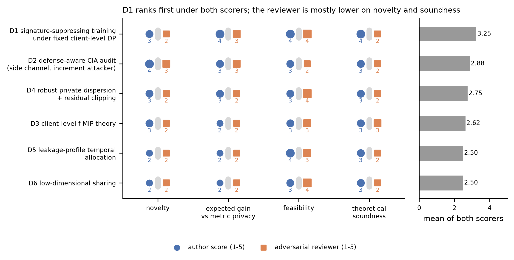
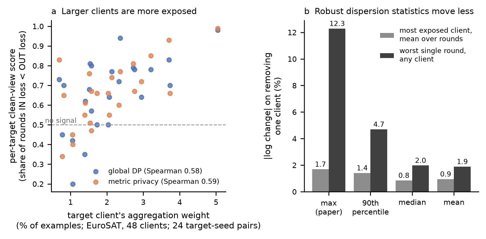

# Research directions against client inference attacks

Date: 2026-10-10. Status: proposal (analysis and design only; no training was run for this document). Owner
decisions taken the same day, binding for execution, are in [agent_roadmap.md](agent_roadmap.md) Section 1; where they
differ from this document they win (in particular, the second dataset is Alzheimer MRI wherever CIFAR-10 is named
below, and primary runs use equal weights with a participation-independent noise level).
Inputs: [project_state.md](project_state.md) (what the repository has established),
[literature_review.md](literature_review.md) (97-entry corpus, [paper_table.csv](paper_table.csv)),
[notes/broad_survey_notes.md](notes/broad_survey_notes.md) (gap table), and new log analyses listed in Section 2.
An adversarial reviewer pass (a reasoning-model reviewer given the evidence and asked to attack each direction) is
stored in [data/direction_reviewer_pass.json](data/direction_reviewer_pass.json); its objections are answered per
direction below.

Notation. Client `i` has data `D_i`, update `u_i`, clipped update `clip(u_i, C)`, aggregation weight `w_i`. The
paper's mechanism adds Gaussian noise with standard deviation `sigma_t = z C / (n_t d_t)`, where `d_t` is the maximum
pairwise (mean-layer Frobenius) distance between client models in round `t`. Global DP (GDP) uses `sigma = z C / n`.
CIA: a curious participant holding a shadow sample of the target's data decides whether the target client
participated (removal adjacency: 48 vs 47 clients in the EuroSAT frontier).

## 0. Summary and recommendation

| Rank | Direction | Role | Score (author / reviewer / mean of 4 criteria) | First test (cost) |
|---:|---|---|---|---|
| 1 | **D1** Signature-suppressing local training under a fixed, public client-level DP noise law | primary mechanism | 3.75 / 2.75 / 3.25 | Stage A screen, no DP, about 20 trajectory-hours |
| 2 | **D2** Defense-aware CIA audit: noise-level side channel and increment likelihood-ratio attacker | primary evaluation; prerequisite for D1 claims | 3.25 / 2.50 / 2.88 | small-federation oracle test, about 10 trajectory-hours |
| 3 | **D4** Robust, privately released dispersion (metric-privacy repair) and residual clipping around the public aggregate | formal sensitivity reduction, composes with D1 | 3.00 / 2.50 / 2.75 | log analysis done (Section 2, E3); Stage A about 15 trajectory-hours |
| 4 | **D3** Client-level f-membership-inference privacy (f-CMIP) for partial-knowledge attackers | theory framing for D1/D6 | 2.75 / 2.50 / 2.62 | calculation only |
| 5 | **D5** Leakage-profile-aware temporal noise allocation | secondary, cheap once D2 exists | 2.75 / 2.25 / 2.50 | 3 schedules, about 15 trajectory-hours |
| 6 | **D6** Low-dimensional sharing (head/adapter) as the regime where crowd privacy pays | secondary | 2.50 / 2.50 / 2.50 | FedRep tiny-head pilot |

Recommended path: **D2-lite then D1, with D4 as the formal follow-up and D3 as the paper's theory section.** The
contribution we would aim to publish: *metric-privacy calibration is equivalent to global DP once leakage is matched,
and its data-dependent noise level is an unaccounted release; a client-level DP mechanism with a fixed public noise law,
combined with local training that suppresses each client's idiosyncratic contribution, reaches lower defense-aware CIA
risk at equal accuracy while keeping a formal guarantee.* Every claim in that sentence is falsifiable with the staged
experiments below; the kill criteria are stated per direction.

Why not "a better noise calibration rule"? The repository already tested per-client noise shapes, non-Gaussian
densities, influence-directed noise and client-built noise, and found no gain over server-side Gaussian noise at
matched risk (project_state.md, Section 4). Isotropic Gaussian noise is optimal against a worst-case attacker under a
fixed sensitivity envelope; the remaining levers are (a) reducing the signal itself (D1), (b) reducing the sensitivity
envelope with formal accounting (D4), (c) restricting the attacker or the shared object so that a distributional
guarantee is non-vacuous (D3, D6), and (d) measuring leakage with attackers that know the defense (D2).

## 1. Design constraints

These follow from the project's evidence and from the reviewer pass. A direction that violates one of them repeats a
known failure.

1. **C1 Compare at matched measured leakage and at matched formal guarantee.** Metric calibration looked better than
   GDP at fixed noise multiplier but behaved like GDP once leakage was matched (STATUS.md; stacked-head comparison).
   Report accuracy at matched defense-aware CIA risk, and CIA risk at matched accuracy, with seed and target bootstrap
   intervals.
2. **C2 Release nothing data-dependent outside the accounted channel.** The paper's `d_t` is computed from private
   client models and changes the noise level (Section 2, E1-E3). Any adaptivity must sit inside the clipped client
   contribution (covered by client-level DP) or be released through an accounted private estimator.
3. **C3 Do not shape noise per client or per direction.** Placement equivalence and isotropic optimality closed that
   family (project_state.md, Section 4).
4. **C4 Report worst-case targets and low-FPR operating points.** Per-target clean-view scores range from 0.20 to 0.98
   (GDP) and 0.34 to 0.99 (metric privacy) on the EuroSAT frontier; the mean hides the targets that matter. Report
   TPR at 5% and 1% FPR pooled over rounds with cluster bootstrap by target-seed, and the top-decile-weight targets
   separately.
5. **C5 Respect the dimension regime.** For the full EurosatCNN (d = 289,194, n = 48) a GMIP-style crowd guarantee is
   about 269 times more noise-hungry than GDP for mu = 1 ([data/gmip_regimes.csv](data/gmip_regimes.csv)); crowd or
   distributional accounting can only pay when n is at least comparable to the dimension of what is shared or attacked.
6. **C6 Include same-family non-private baselines.** A signal-reduction defense must beat plain regularization
   (weight decay, fewer local epochs) at matched accuracy, otherwise it rediscovers "generalization reduces membership
   signal" ([Liu et al. 2021][Liu2021GenOutperformDP]; [Yeom et al. 2018][Yeom2018Overfitting]).

## 2. New evidence from committed logs

Script: [scripts/analyze_direction_evidence.py](scripts/analyze_direction_evidence.py) (reads the EuroSAT frontier
training JSONs, `results/cia_frontier/eurosat_frontier/results/frontier/`, noise ratio 0.001546, seeds 42-44).

| ID | Question | Result | File |
|---|---|---|---|
| E1 | Does the noise level reveal participation at 48 clients? | GDP: noise identical IN and OUT (the frontier runner fixes the numerical sigma across removal). Metric privacy: per-target mean log ratio of sigma IN/OUT from -1.1% to +0.8% (mean -0.05%); sigma_IN < sigma_OUT in 50% of rounds on average (range 38-72%). Noise-to-signal ratio median 9.5 (metric privacy), 5.9 (GDP). | [data/noise_level_side_channel_48client.csv](data/noise_level_side_channel_48client.csv) |
| E2 | And in small federations? | Plan-suite runs with 3 (IN) vs 2 (OUT) clients, z = 0.01 (Alzheimer, CIFAR, Fashion-MNIST; 3 seeds x 20 rounds each). GDP noise L2 norm 42.55 vs 63.82 on Alzheimer: the 2/3 participant-count factor, present for **both** mechanisms. Metric privacy adds a distance factor `d_IN/d_OUT` with per-dataset mean 1.032-1.093 (per round 0.78-1.60; larger IN in 57-88% of rounds); `sigma_IN < sigma_OUT` in all 180 round pairs; the target is in the max pair in 96.7-98.3% of rounds. | [data/metric_noise_3client.csv](data/metric_noise_3client.csv) |
| E3 | How sensitive is the dispersion statistic to one client? | Leave-one-client-out change of the round's statistic: max (paper) 1.69% for the most exposed client on average, 12.3% worst single round; 90th percentile 1.41% / 4.69%; median 0.84% / 1.97%; mean 0.95% / 1.89%. | [data/dispersion_statistic_loo_sensitivity.csv](data/dispersion_statistic_loo_sensitivity.csv) |
| E4 | Which targets are exposed? | Per-target clean-view score rises with the target's aggregation weight: Spearman 0.58 (GDP) and 0.59 (metric privacy), n = 24 target-seed pairs each, p <= 0.003. Relative model distance and update norm correlate similarly (0.55-0.65) but are collinear with weight (Spearman 0.96 and 0.95); given weight, distance adds nothing under GDP (partial 0.00) and little under metric privacy (0.33, p = 0.12). Noisy-view scores are saturated and uncorrelated. | [data/target_idiosyncrasy_correlations.csv](data/target_idiosyncrasy_correlations.csv), [data/target_idiosyncrasy_partial.csv](data/target_idiosyncrasy_partial.csv) |
| E5 | Does equal weighting alone help? (prior team, `results/cia_frontier/weighting_comparison.pdf`) | No. Vanilla attack score 0.76 to 0.85 on EuroSAT and 0.87 to 0.86 on CIFAR-10 when switching to equal weights; mixed under DP; accuracy 0.3-3.8 pp lower. | (existing PDF) |
| E6 | How far is the realistic attacker from the worst case? | Oracle-direction per-round signal-to-noise proxy `w_i min(norm(u_i), C) / sigma`: median 7.5 (GDP) and 4.3 (metric privacy) for the 10 targets. Equal-weight GDP per-round mu at this noise is about (C/n)/sigma = (5/48)/0.0077 = 13.5, about 135 over 100 rounds. Realistic loss-based attackers reach seed-mean clean-view scores of 0.60-0.76. | [data/oracle_projection_snr_proxy.csv](data/oracle_projection_snr_proxy.csv) |

Reading of E1-E6:

- The metric-privacy side channel (Direction D2 in earlier notes) is **weak at 48 clients** and **strong only in
  small federations**, where most of it is the participant count in the denominator, which GDP shares. The
  48-client frontier is already protected against the count leak because its runner keeps sigma fixed across
  removal. Claims about the side channel must therefore be restricted to small federations and to the distance factor.
- **Exposure is driven by contribution size**: in EuroSAT with alpha = 0.3, larger clients take more local steps at
  fixed epochs, move further, and receive more weight. This matches the first-order analysis in D1 (gap proportional
  to `w_i K_i`) and explains why equal weighting alone does not help (E5): it shifts exposure from large to small clients
  but leaves the number of local steps `K_i` proportional to data size.
- **Formal guarantees at the frontier's noise are vacuous** (E6); the defenses work only because the realistic attacker
  is weak. That is the strongest argument for D2 (measure leakage with stronger, defense-aware attackers before
  claiming a frontier) and for D3 (state guarantees for the partial-knowledge attacker that the CIA actually is).
- **Robust statistics are about six times less sensitive** in the worst round than the max (E3). A privatized robust
  dispersion statistic is a cheap repair of metric privacy (D4).

## 3. Directions

### D1. Signature-suppressing local training

Full title: signature-suppressing local training under a fixed, public client-level DP noise law. Role: primary mechanism.

**Hypothesis.** The CIA signal is the target's *participation gap* (the extra loss reduction on the target's
distribution caused by including the target) and it is carried by the target's idiosyncratic update component, not by
the consensus component that the crowd would produce anyway. Suppressing the idiosyncratic component in local training,
while the server adds noise from a fixed public law, lowers realized CIA risk at a smaller accuracy cost than adding
noise, and keeps the GDP guarantee unchanged.

**Formal argument.**

*P1 (fixed-law invariance; standard).* If the server adds `N(0, sigma^2 I)` to the sum of clipped updates with
`sigma` a function of public quantities only (`z`, `C`, a public slot count `n`), then each round is a Gaussian
mechanism with sensitivity `C` for add/remove of one client, whatever local algorithm the clients run, including
data-dependent and adaptive ones; composition over `T` rounds gives `sqrt(T) C / sigma`-GDP
([Dong et al. 2022][Dong2022GDP]; [McMahan et al. 2018][McMahan2018DPLM]). Hence D1 inherits GDP's accountant exactly
and metric privacy, whose `sigma_t` depends on `d_t`, does not. Two implementation conditions are needed: equal or
bounded public weights (the repository's default size weighting has removal sensitivity `2 a_target C`, not `C/n`;
[threat_specification_review.md](../threat_specification_review.md), Section 4), and a fixed denominator.

*P2 (first-order participation gap; heuristic to be checked numerically).* Linearize one round of FedAvg around
`theta`, with local update `Delta_j ~ -eta K_j g_j`, `g_j = grad L_j(theta)`. Including client `i` changes the aggregate
by `delta_i = w_i (Delta_i - Delta_bar_{-i})`, so the loss change on the target's distribution is

    Gamma_i = L_i(theta_OUT) - L_i(theta_IN) ~ w_i eta K_i < g_i , g_i - g_bar_{-i} >
            = w_i eta K_i ( norm(e_i)^2 + < g_bar_{-i} , e_i > ),   e_i = g_i - g_bar_{-i}.

The consensus component contributes nothing: a client whose gradient equals the crowd's has no participation gap. The
per-round noise contribution to the attacker's loss statistic has standard deviation about `sigma norm(g_i)`, so the
per-round signal-to-noise ratio is at most `w_i eta K_i norm(e_i) / sigma`. Halving it by noise needs `sigma` doubled
in all `d` directions; halving it by suppression needs `norm(e_i)` (or `w_i K_i`) halved, which costs utility only to
the extent that `e_i` carries population-useful information. In label-skewed federations, much of `e_i` is client drift
toward the client's own label marginal, which drift-correction methods reduce precisely because it hurts global
accuracy ([Karimireddy et al. 2019][Karimireddy2020SCAFFOLD]; [Li et al. 2018][Li2020FedProx]). E4 supports the
`w_i K_i` factor (exposure rises with client size, where both `w_i` and `K_i` scale with data size). E5 is consistent
with it: equal weights change `w_i` but not `K_i`.

**Mechanism family (cheapest first).**

1. Existing knobs, almost no code change: FedProx (aggregation `fedprox` in `metricdp_pytorch/strategy_factory.py`,
   currently with `proximal_mu=0.5` fixed; the term itself is `proximal_term` in `experiments/reproduce/paper_training.py`,
   so a mu sweep needs only that value exposed as a run option), `local-epochs` 1-2 instead of 5, and
   `--aggregation-weighting equal`.
2. Fixed local steps per round (`K_i = K` for all clients) combined with equal weights: equalizes `w_i K_i`, the factor
   E4 points to. Small change in the training loop (step budget instead of epochs).
3. Consensus distillation: local loss `CE(theta; D_i) + beta KL(p_theta_global(x) || p_theta(x))` on local data, a
   function-space proximal term that penalizes moving predictions away from the consensus on the client's own inputs.
   About 40 lines next to the proximal term in `paper_training.py`.
4. Drift correction with a public control variate: correct local gradients by the previous released (noised) global
   update, which is public post-processing; client-held control variates stay local and are covered by P1.
5. Adaptive strength: each client sets `beta_i` from its own local-vs-global loss gap. Allowed by P1 because it stays
   inside the clipped contribution; this is the "adaptivity inside the accounted channel" that metric privacy lacks.

Composition: each variant runs with GDP noise from the fixed law (and without noise for the Stage A screen).

**Why it can beat metric privacy.** Metric privacy reduces noise when clients disagree (large `d_t`), which is exactly
when idiosyncratic components, and hence CIA signal, are largest; it is anti-aligned with outlier vulnerability
([literature_review.md](literature_review.md), Section 2). D1 acts on the signal and leaves the noise law fixed, so at matched measured leakage
the remaining question is purely utility, and at matched noise it has a formal guarantee that metric privacy lacks.

**How it avoids the client-specific-noise failure.** It does not shape noise (C3), releases nothing new (C2), and does
not need public data (the stacked-head construction was limited by 32 public images).

**Closest prior and novelty delta.** Record-level membership defenses that reduce signal by regularization or
distillation: adversarial regularization ([Nasr et al. 2018][Nasr2018AdvReg]), SELENA ([Tang et al. 2021][Tang2021SELENA]),
RelaxLoss ([Chen et al. 2022][Chen2022RelaxLoss]), HAMP ([Chen et al. 2024][Chen2024HAMP]). FL signal-reduction defenses
against other attacks: FinP for source inference ([Zhao et al. 2026][Zhao2026FinP]), CoFedMID for trajectory membership
([Bai et al. 2026][Bai2026CoFedMID]); contribution capping against user inference ([Kandpal et al. 2024][Kandpal2024UserInference]).
Delta: (i) the protected unit is the whole client distribution and the reference is the federation's consensus, not a
held-out reference model or public data; (ii) the link between client drift and CIA signal (P2) and its test; (iii) a
formal client-level guarantee retained by construction (P1) rather than an empirical-only defense; (iv) evaluation with
defense-aware attackers (D2). We found no paper that evaluates drift correction or consensus distillation as a defense
against client participation inference ([literature_review.md](literature_review.md), Section 5); this is a search result, not proof of absence.

**Reviewer objections and responses.**

| Objection | Response / design change |
|---|---|
| Confounded with plain generalization; may rediscover "regularization reduces MIA". | Accepted as the main risk. Stage A includes weight decay and fewer epochs as controls (C6); the claim requires beating them at matched accuracy, and the P2 prediction (signal tracks `w_i K_i norm(e_i)`, not train-test gap) separates the two mechanisms. |
| Outlier (worst-case) targets may not improve. | Kill criterion 2 below is defined on top-decile-weight targets. |
| The metric-privacy baseline's calibration shifts when local training changes. | Compare at matched measured leakage, re-tuning the noise ratio of every mechanism on its own training procedure (C1), and also report MDP + the same local training. |
| Formal guarantee identical to GDP, so no theory gain. | Correct, and stated as such. The formal gain comes from D4 (smaller residual sensitivity once updates concentrate near consensus) and from D3 for partial-knowledge attackers. |

**Risks.** Accuracy loss on clients with genuinely unique content (report per-client and per-class accuracy as a fairness
check); attacker signal may move to the noisy view or to late rounds; equal weighting changes optimization (E5).

**Kill criteria.** (1) Stage A: no variant lowers the pooled clean-view score or AUC by at least 0.05 relative to vanilla
at no more than 1 pp accuracy loss, or none beats weight decay / fewer epochs at matched accuracy: stop. (2) Stage B: at
matched defense-aware AUC and TPR at 1% FPR, no gain of at least 2 pp accuracy over the better of GDP and metric privacy
on EuroSAT alpha = 0.3 and CIFAR-10 (48 clients, 3 seeds), or no reduction for top-decile-weight targets: stop.

**Staged experiment design.** One trajectory (48 clients, 100 rounds, EuroSAT CNN) took a median 0.68 h training plus
0.06 h evaluation in the 88 committed frontier runs; 50 rounds about 0.37 h. Removal adjacency needs one IN trajectory
per seed plus one OUT trajectory per target and seed.

- *Stage A (screen; no DP).* EuroSAT alpha = 0.3, 48 clients, seed 42, 50 rounds, 5 targets (the two largest-weight
  targets plus three spread over the weight range, chosen from [data/target_idiosyncrasy_vs_cia_score.csv](data/target_idiosyncrasy_vs_cia_score.csv)
  before running). Configurations: vanilla; weight decay 5e-4; local epochs 1; FedProx mu in {0.01, 0.1, 1}; fixed
  steps + equal weights; consensus KL beta in {0.3, 1}. Nine configurations x 6 trajectories x 0.37 h, about 20
  trajectory-hours. Outputs: pooled clean-view and noisy-view scores, accuracy, per-target scores, and per-round
  `norm(e_i)` proxies (distance of each client update to the leave-one-out mean, logged).
- *Stage B (frontier).* Two best Stage A variants x GDP at three noise ratios, against GDP-only and metric-privacy-only on
  the same grid, vanilla, 3 seeds, 8 targets, 100 rounds; reuse the committed GDP and metric-privacy runs at ratio 0.001546.
  About 150-260 trajectory-hours depending on reuse; then CIFAR-10 with the same protocol. Evaluate with the D2 attack suite.
- *Stage C (mechanistic check of P2).* Regress per-target, per-round loss gaps on logged `w_i`, `K_i` and `norm(e_i)`
  proxies across the Stage B runs.

### D2. Defense-aware CIA audit

Full title: defense-aware CIA audit with a noise-level side channel and increment likelihood-ratio attackers. Role: primary evaluation.

**Hypothesis.** The repository's CIA statistic (share of rounds in which the target's shadow loss is lower IN than OUT,
using the paired OUT trajectory) measures distinguishability for a loss-only observer. An attacker that knows the
defense can use additional channels: the noise level (metric privacy, and both mechanisms when the denominator varies),
and per-round loss increments with known noise law. The mechanism ranking may change under such attackers.

**Attacker specification (answers the reviewer's main objection).** The peer attacker sees all released global models
`theta_t`, its own data and updates, the target shadow sample, and the public protocol (`z`, `C`, mechanism, rounds);
it does not see other clients' updates or the true participant count unless the protocol publishes it. It may simulate
reference federations with its own data and shadow sample (LiRA-style; [Carlini et al. 2022][Carlini2022LiRA]).

**Components.**

1. *Noise-level side channel.* The attacker estimates `sigma_t` from `norm(theta_{t+1} - theta_t)^2 = norm(s_t)^2 +
   sigma_t^2 D + cross term`. With `D = 289,194` the chi-square fluctuation is about `1/sqrt(2D)`, 0.13% of sigma per
   round; the bias from the unknown signal is `1/(2 NSR^2)`, about 0.6% at the frontier's metric-privacy noise-to-signal
   ratio 9.5 (E1), and can be partly removed with the attacker's own update norm. At 48 clients the true sigma shift is
   below 1.1% per target (E1), so the channel is weak; in small federations it is large (E2). Test the distance factor
   alone with a fixed denominator.
2. *Increment likelihood-ratio attacker.* Per-round loss increment on the shadow sample, `L_shadow(theta_{t+1}) -
   L_shadow(theta_t)`, compared with its distribution under OUT from reference simulations, with Gaussian noise
   contribution of known variance `sigma_t^2 norm(grad L_shadow)^2`; aggregate across rounds. This is the
   shadow-sample analogue of the GLiR attack of [Leemann et al. 2023][Leemann2023GMIP] and needs only scalars per round,
   so it does not suffer the dimension problem of the full-gradient bound (the reviewer's concern).
3. *Low-FPR reporting* per C4, pooled over rounds and targets with cluster bootstrap.

**Why it matters for beating metric privacy.** If metric privacy leaks through `sigma_t`, its empirical advantage is
partly an artifact of attackers that ignore the defense; if it does not (as E1 suggests at 48 clients), the audit still
supplies the stronger attacker that D1's frontier claims need. A leak-free metric variant is D4 item 1.

**Closest prior.** Auditing DP with stronger adversaries ([Jagielski et al. 2020][Jagielski2020Auditing];
[Nasr et al. 2021][Nasr2021Instantiation]; [Nasr et al. 2023][Nasr2023TightAuditing]), FL auditing with canaries
([Maddock et al. 2022][Maddock2022CANIFE]; [Andrew et al. 2023][Andrew2023OneShot]), side channels in privacy
implementations ([Debenedetti et al. 2023][Debenedetti2023SideChannels]), and data-dependent DP mechanisms whose
parameters must be privatized ([Nissim et al. 2007][Nissim2007Smooth]; [Papernot and Steinke 2021][Papernot2021HPTuning]).
Delta: a client-level, defense-aware audit for metric-type calibration and an explicit treatment of the noise level as a
release.

**Reviewer objections and responses.** Attacker knowledge underspecified: specified above, and the E1 analysis shows
the blind sigma estimate is precise but the 48-client shift is too small to matter. Compute scope too large: reduced to
the increment attacker plus side-channel test; full LiRA with many reference federations deferred.

**Kill criteria.** Drop the side-channel claim if the oracle-reference noise-level attack has AUC <= 0.55 for the
largest-weight targets in 3-8 client federations with a fixed denominator. Drop the increment attacker if it is not
stronger than the current loss statistic at TPR at 5% FPR in Stage A runs.

**Experiment.** Stage A: EuroSAT and Alzheimer, 3, 5 and 8 clients with fixed denominator, metric privacy and GDP,
3 seeds, all targets, 50 rounds (small federations are cheap; about 10 trajectory-hours). Add per-round logging of
the shadow-sample loss increment and gradient norm (scalars) to the runner used by Stage B of D1.

### D3. Client-level f-MIP theory

Full title: client-level f-membership-inference privacy (f-CMIP) for partial-knowledge attackers. Role: theory.

**Idea.** Lift GMIP ([Leemann et al. 2023][Leemann2023GMIP]) from records to clients: the target client is drawn from
the population of clients, and the attacker knows only a shadow sample from the target's distribution
([Kaissis et al. 2023][Kaissis2023RelaxedThreat] for relaxed threat models; [Izzo et al. 2022][Izzo2022MIP];
[Triastcyn and Faltings 2019][Triastcyn2019BDPFL] for a client-level distributional accountant). Derive the trade-off
function of the CIA hypothesis test as a function of `n`, the dimension of the attacked statistic, the shadow-sample size
and the noise.

**What it can and cannot deliver.** The reviewer's objection is correct for the full model: with `d >> n` the crowd
guarantee collapses to GDP-type noise (E6, [data/gmip_regimes.csv](data/gmip_regimes.csv)). The useful results are
(a) a formal statement that metric calibration cannot be justified as distributional privacy in the `d >> n` regime;
(b) bounds for attackers restricted to `k`-dimensional statistics of the release (the increment attacker of D2 is
one-dimensional per round), where the effective dimension is small and the crowd term can matter; (c) the theory behind
D1's P2 (the attacker's power as a function of `w_i K_i norm(e_i)`). Non-exchangeable targets (largest clients, E4) break
the population-sampling premise; handle them with a worst-case-over-subpopulation variant.

**Kill criterion.** If the partial-knowledge bound is never at least 20% tighter than the GDP bound in runnable regimes
(EuroSAT, CIFAR-10, 8-48 clients), keep D3 as a short theory note supporting D1 and D2.

### D4. Robust dispersion and residual clipping

Full title: robust, privately released dispersion and residual clipping around the public aggregate. Role: formal follow-up.

**Item 1: leak-free metric privacy.** Replace the max pairwise distance by a robust statistic (median or a lower
quantile) and release it through an accounted private estimator (smooth sensitivity or propose-test-release:
[Nissim et al. 2007][Nissim2007Smooth]; [Wang et al. 2022][Wang2022PTRRDP]; private quantiles as in
[Andrew et al. 2021][Andrew2021AdaptiveClip]). E3 shows that the median moves at most 1.97% in any round when one client
is removed, against 12.3% for the max, so the privatization cost is small. This gives the paper's mechanism a formal
guarantee and is the fairest version of the baseline to beat.

**Item 2: residual clipping.** Release `c_t + (1/n) sum_i clip(u_i - c_t, rho) + N(0, sigma^2 I)` where `c_t` is the
previous round's released update (public, so centering leaks nothing new) and `rho` is a privately estimated quantile of
residual norms. With a fixed denominator the add/remove sensitivity is `rho` instead of `C`, so the noise can shrink by
`rho/C` at the same guarantee. When D1 concentrates updates near the consensus, `rho` can be small without clipping
much signal ([Levy et al. 2021][Levy2021UserLevel] for the concentration argument; [Karimireddy et al. 2020][Karimireddy2021CenteredClip]
for centered clipping in robust aggregation). Note that Levy et al.'s error depends on the concentration radius, which
is the opposite direction to the paper's inverse-distance rule.

**Reviewer objections and responses.** Leak moves into `rho` and `c`: `c_t` is public post-processing and `rho` is
released by an accounted private quantile; E3 shows that quantiles have low leave-one-out sensitivity. Resembles failed
centering: the earlier work centered on a public-data residual in a one-shot head step with 32 public images; here the
center is the federation's own released aggregate and the gain is a formal sensitivity reduction, not a noise shape.
Nonstandard adjacency: with a public slot count and absent clients contributing zero residual, add/remove sensitivity
is `rho` by the triangle inequality; needs a written proof and a unit test.

**Kill criterion.** Stop if residual clipping costs more than 2 pp accuracy relative to plain clipping at the same
guarantee, or does not reduce CIA risk for top-decile-weight targets.

### D5. Temporal noise allocation

Full title: leakage-profile-aware temporal noise allocation. Role: secondary.

The clean-view gap is largest in rounds 1-25 (0.039-0.052) and falls to 0.020-0.031 in rounds 51-100, while the
noisy-view gap grows over training (project_state.md). Under a fixed total GDP budget (`sum_t mu_t^2` fixed),
allocate more noise to the rounds where the attacker's evidence accrues. Prior work allocates by utility
([Kiani et al. 2025][Kiani2025TimeAdaptive]). The reviewer's points are accepted: post-hoc reweighting of existing logs is
not possible (noise changes the trajectory), and the signal may migrate to later rounds. Test only after D2's increment
attacker exists: three schedules (uniform, front-loaded, back-loaded) at equal total budget, Stage A protocol. Kill if
the attack advantage moves rather than shrinks.

### D6. Low-dimensional sharing

Full title: low-dimensional sharing as the regime where crowd privacy pays. Role: secondary.

Share only a head or adapter (FedPer, FedRep: [Arivazhagan et al. 2019][Arivazhagan2019FedPer];
[Collins et al. 2021][Collins2021FedRep]). For a head with d = 51-132 and n = 8, the noiseless GMIP mu is 2.45-3.94 and
the GMIP/GDP noise ratio for mu = 1 is 3.3-5.6, compared with 269 for the full EurosatCNN at n = 48
([data/gmip_regimes.csv](data/gmip_regimes.csv)). The reviewer's objection stands: n comparable to d is only reached for
very small heads, and personalization moves the client signature into unshared layers, which a peer cannot observe but
which may degrade the global object. Test with a FedRep tiny-head pilot only if D3 yields a useful bound in this regime.

## 4. Considered and not recommended

| Idea | Reason |
|---|---|
| Further per-client noise shapes, non-Gaussian densities, influence-directed noise | Closed by project evidence (placement equivalence, isotropic optimality, influence pilot accuracy 86.00% to 70.81% at f = 0.5). |
| Sharpness-aware local training as a privacy measure | May increase membership risk ([Kim et al. 2023][Kim2023SAMRisk]). |
| Secure aggregation alone | The CIA attacker observes the aggregate, which secure aggregation does not hide ([Bonawitz et al. 2017][Bonawitz2017SecAgg]). |
| Record-level DP-SGD at clients | Wrong protected unit for CIA; client-level guarantees need group-privacy scaling. |
| Input perturbation of client data (CIP) | Reported against record-level MIA ([Yang et al. 2023][Yang2023CIP]); a candidate baseline for D1 rather than a direction. |

## 5. Programme, gates and compute

1. Week 1: implement the fixed-denominator option and per-round scalar logging (shadow loss increment, gradient norm,
   per-client residual-norm proxy) in the frontier runner; unit tests with synthetic data (no training). D2 Stage A in
   small federations (about 10 trajectory-hours). Gate: decide whether the side channel enters the paper.
2. Week 1-2: D1 Stage A screen (about 20 trajectory-hours). Gate: kill criterion D1-1.
3. Weeks 2-4: D1 Stage B on EuroSAT with the D2 attacker (150-260 trajectory-hours), then CIFAR-10. Gate: kill
   criterion D1-2. In parallel: D3 calculations and the D4 item 1 privatized robust baseline.
4. Weeks 4-6: D4 item 2 (residual clipping) composed with the best D1 variant; D5 only if time remains.

Repository conventions apply: one branch per experiment (`feature/<name>`), `uv run`, protocol written before runs,
reports only from committed result files, no `Co-Authored-By` trailers (AGENTS.md).

## 6. Open questions for the owner

1. Is the participant count public in the intended deployment? If yes, the removal-adjacency CIA is trivial in small
   federations; if no, every mechanism needs a fixed denominator (E2).
2. Should the default aggregation stay size-weighted (better accuracy, sensitivity `2 a_target C`) or switch to equal or
   capped public weights (matches `C/n`)? E4-E5 suggest weighting interacts with exposure; D1 Stage A tests it.
3. Which target set defines "worst case" for the paper: largest-weight clients, or the largest per-target score under the
   current attack?
4. Is CIFAR-10 (48 clients) the second dataset, or Alzheimer MRI as in the paper?

<!-- references -->
[Andrew2021AdaptiveClip]: https://doi.org/10.48550/arxiv.1905.03871
[Andrew2023OneShot]: https://doi.org/10.48550/arxiv.2302.03098
[Arivazhagan2019FedPer]: https://doi.org/10.48550/arxiv.1912.00818
[Bai2026CoFedMID]: https://doi.org/10.48550/arxiv.2601.06866
[Bonawitz2017SecAgg]: https://doi.org/10.1145/3133956.3133982
[Carlini2022LiRA]: https://doi.org/10.1109/sp46214.2022.9833649
[Chen2022RelaxLoss]: https://doi.org/10.48550/arxiv.2207.05801
[Chen2024HAMP]: https://doi.org/10.14722/ndss.2024.23014
[Collins2021FedRep]: https://doi.org/10.48550/arxiv.2102.07078
[Debenedetti2023SideChannels]: https://doi.org/10.48550/arxiv.2309.05610
[Dong2022GDP]: https://doi.org/10.1111/rssb.12454
[Izzo2022MIP]: https://doi.org/10.48550/arxiv.2211.06582
[Jagielski2020Auditing]: https://doi.org/10.48550/arxiv.2006.07709
[Kaissis2023RelaxedThreat]: https://doi.org/10.52202/075280-2435
[Kandpal2024UserInference]: https://doi.org/10.18653/v1/2024.emnlp-main.1014
[Karimireddy2020SCAFFOLD]: https://doi.org/10.48550/arxiv.1910.06378
[Karimireddy2021CenteredClip]: https://doi.org/10.48550/arxiv.2012.10333
[Kiani2025TimeAdaptive]: https://doi.org/10.48550/arxiv.2502.18706
[Kim2023SAMRisk]: https://doi.org/10.48550/arxiv.2310.00488
[Leemann2023GMIP]: https://doi.org/10.48550/arxiv.2306.07273
[Levy2021UserLevel]: https://doi.org/10.48550/arxiv.2102.11845
[Li2020FedProx]: https://doi.org/10.48550/arxiv.1812.06127
[Liu2021GenOutperformDP]: https://doi.org/10.48550/arxiv.2110.05524
[Maddock2022CANIFE]: https://doi.org/10.48550/arxiv.2210.02912
[McMahan2018DPLM]: https://doi.org/10.48550/arxiv.1710.06963
[Nasr2018AdvReg]: https://doi.org/10.1145/3243734.3243855
[Nasr2021Instantiation]: https://doi.org/10.1109/sp40001.2021.00069
[Nasr2023TightAuditing]: https://doi.org/10.48550/arxiv.2302.07956
[Nissim2007Smooth]: https://doi.org/10.1145/1250790.1250803
[Papernot2021HPTuning]: https://doi.org/10.48550/arxiv.2110.03620
[Tang2021SELENA]: https://doi.org/10.48550/arxiv.2110.08324
[Triastcyn2019BDPFL]: https://doi.org/10.1109/bigdata47090.2019.9005465
[Wang2022PTRRDP]: https://doi.org/10.48550/arxiv.2209.07716
[Yang2023CIP]: https://doi.org/10.1109/dsn58367.2023.00037
[Yeom2018Overfitting]: https://doi.org/10.1109/csf.2018.00027
[Zhao2026FinP]: https://doi.org/10.56553/popets-2026-0136
