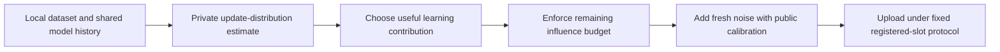

> Subsequent verified evidence: [one-time descriptor findings, 2026-10-07](2026-10-07_private_descriptor_findings.md). The cumulative influence filter did not pass its bounded utility gate. The active recommendation is now the aggregate class-balanced voting constructor, followed by fixed-slot CIA evaluation; individual distributions and client-specific noise-density estimation remain unsolved. This decision document is historical rationale.

> Phase result: [coupled filter findings and updated priorities](2026-10-06_client_energy_filter_findings.md). The proposed filter-policy phase has now run; the recommendation below records the pre-run reasoning.

# Research direction decision after the construction review

2026-10-06. Owner authorized sustained work until promising knowledge or a technique can shape the roadmap. We continued beyond the scalar-paper review into temporal mechanisms, one-time private surrogates and individual privacy filters. This note separates established findings from a proposed new construction question. No overall experiment completion or paper novelty is declared.

## What we learned that changes the roadmap

**The limiting object is the client's complete contribution across observable training, not the name of the one-round noise density.** Three independently reviewed findings make this concrete:

1. Scalar multi-scale Laplace is an important non-Gaussian comparator, but its high-budget benefit does not transfer unchanged to many coordinates and rounds. The paper's explicit continuous parameter choice has variance ratios to sensitivity-matched scalar Laplace of4.853 at epsilon2,1.904 at4,0.393 at8,0.00695 at16. Thus even its finite scalar advantage is regime-specific. [Methods](../literature_review/divisible_noise_methods.md); [real arithmetic artifact](../../results/client_specific_noise/divisible_certificate_audit.json).
2. Under a robust full-participation row-ball envelope, spatially isotropic Gaussian noise and a public linear-workload MSE objective, optimized independent noise is already optimal. Generic temporal correlation cannot improve that objective. The proof assumes dimension≥rounds and an unrestricted per-round difference set; it does not rule out tighter reachable trajectory geometry or nonlinear learning utility. [Temporal methods and derivation](../literature_review/temporal_noise_followup.md); [independent mathematical review](2026-10-06_temporal_geometry_math_review.md).
3. Existing individual privacy filters provide a constructive alternative: enforce a cumulative bound on each client's actual contributions. Local statistics can guide clipping under that invariant without being separately published, while a fixed public noise law protects the transcript. Whole-client transfer is valid under the explicit peer/dummy/shared-history assumptions. [Technique and transfer](../literature_review/client_influence_filter.md); [independent review](2026-10-06_client_energy_filter_math_review.md).

This is substantial directional knowledge, not a newly demonstrated defense. It explains why several earlier covariance/selector spikes had little headroom and identifies a better-defined place for distribution construction to matter.

## Recommended construction question

**Can a client learn a useful policy from its update distribution that allocates a bounded cumulative influence budget across training, preserving more useful signal than optimized public clipping schedules, while a filter guarantees the complete transcript's privacy?**

Each client would maintain its own update history/distribution model and a private remaining budget. That model guides which components or rounds to preserve. A hard filter enforces a public whole-client bound before every release. Fresh noise continues even when the learning budget is exhausted, maintaining the registered-slot dummy law. The initial proof/control keeps noise parameters public; privately learned noise shapes are a later extension requiring their own certificate.

The proposed data flow is:

The empty or exhausted slot retains the noise and message stages. The estimate guides the signal; it does not secretly change the certified noise covariance.

The research contribution would have to be the distribution-guided admissible policy, its complete accounting and a measured advantage. Feldman–Zrnic already supplied cumulative filters; matrix mechanisms already supplied temporal noise shaping; Harrison–Manurangsi already supplied divisible non-Gaussian scalar laws. Combining names does not establish novelty. This recommendation refines the supervisor's construction idea; it does not pretend a new noise density is necessary or already designed.

## Secondary route: privatize a client distribution once

A sanitized client descriptor or finite surrogate can be constructed once, after which all training uses only that object. The whole transcript is then post-processing, avoiding repeated raw-data charges. This fits the distribution-construction question but can lose too much information at whole-client sensitivity, especially with eight clients. Independently privatizing local histograms has an N-fold variance disadvantage over a matched one-time trusted-server aggregate. Sampling repeatedly from a raw-data-fitted private sampler is a different operation and still composes. [Eight-source technique handoff and constructor](../literature_review/private_surrogate_followup.md).

Keep this as a comparator/backup, not a promised winner. Public-only training, one-time central release and pooled private-surrogate training are mandatory controls; otherwise an apparent advantage may just come from useful public anchors.

## Next bounded phase

1. Specify the energy-filter protocol and public calibration. Include fixed roster/weights, dummy noise, coalition floor, deterministic/shared-history client execution and a genuinely coupled noisy trajectory.
2. Audit cumulative contribution energy and clipping signal on the reduced real-data classifier. First compare the existing remaining-energy rule and optimized public schedules; evaluate raw-information policy headroom before training a learned constructor.
3. Compare equal total whole-client accounting, aggregate noise law and release schedule. Add time-varying public clipping, the strongest one-release/one-time-surrogate references where schedule changes are clearly labeled, and a matched central implementation of the same law.
4. Advance a learned policy only if useful signal and held-out utility survive its enforced cap. A retained0.001 CE gate can be preregistered for a reduced-model feasibility test, but the old quadratic proxy and noise-only intervals cannot certify it.
5. Only after feasibility: independent IN/OUT trajectory attacks, clean disjoint auxiliary data plus strong-overlap stress, temporal/model attackers, and meaningful accuracy. Compare the historical metric-inspired frontier as a separate empirical benchmark, not as an epsilon-certified reference.

This phase is a proposal, not a launch disguised as a completed result. The sustained review has reached a tractable construction direction and an independently checked reason for it; the overall research remains active.

## Verification and evidence boundaries

No Flower/CNN/CIA experiment was launched. The only new executable output is deterministic scalar variance/certificate arithmetic: four scalar settings and27 conservative coordinate/round allocations, no Monte Carlo or model loss. Primary methods were read with explicit scopes in each card; follow-up families stay separate from frozen31-family systematic counts. Several published pseudocode/notation errors were identified and isolated before any port. Mathematical reviews cover the scalar transfer, robust temporal limit and energy-filter transfer; these are not end-to-end implementation audits or utility guarantees.
